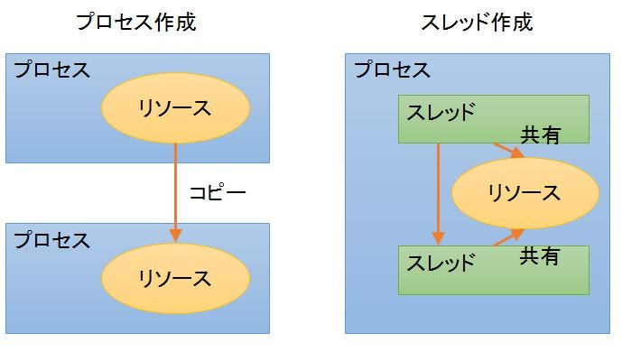

linux上のアプリケーションはプロセスとして起動されます。

プロセスを管理することはOS（ここではlinux）の重要な役割であり、プロセスのスケジューリング、割り込み、シグナル制御、優先度の制御、プロセスの切り替え、状態管理、メモリ管理などを行っています。

**プロセスとは何でしょう？**

プロセスはCPU上で実行されるもので、タスクを完了するために、Linuxのカーネルが制御するあらゆるリソースを使うことができます。

**スレッドとは何でしょう？**

スレッドは1つのプロセスから生成される実行単位です。同じプロセスから並行でスレッドを起動させることができます。

スレッドはメモリや、オープン中のファイルなどのリソースを共有することができます。同じアプリケーションのデータにアクセスすることができるのです。

プロセスはリソースを共有することができないので、これは大きな違いです。

言い換えると、スレッドは同じタイミングで、共有しているリソースに変更をかけるべきではないことも意味しています。

そのために、ロックをかけたり、シリアルに動かしたりという制御をするのはアプリケーションの責任ということになります。

<!--more-->

**プロセスとスレッドの違い。**

上記で少し触れましたが、プロセスはリソースを共有することができません。そのため、プロセスを起動させるには、リソースをコピーすることが必要になってきます。

その分、性能の観点からはスレッドを起動するほうが、効率的、ということになります。

一方、プロセスとスレッドは、スケジューリングの観点からは同じような特徴を持っていますので、カーネルからは同じように扱われます。

＋＋＋

参考：[Linux Performance and Tuning Guidelines](http://www.redbooks.ibm.com/redpapers/pdfs/redp4285.pdf)

