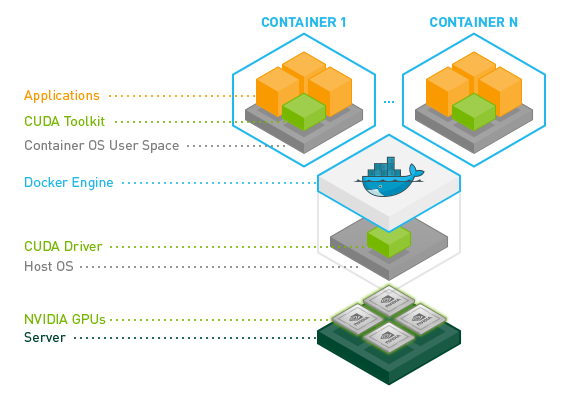
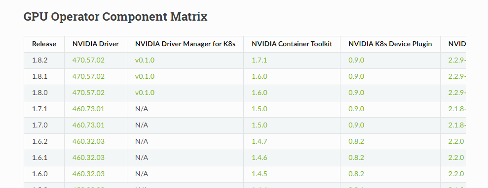
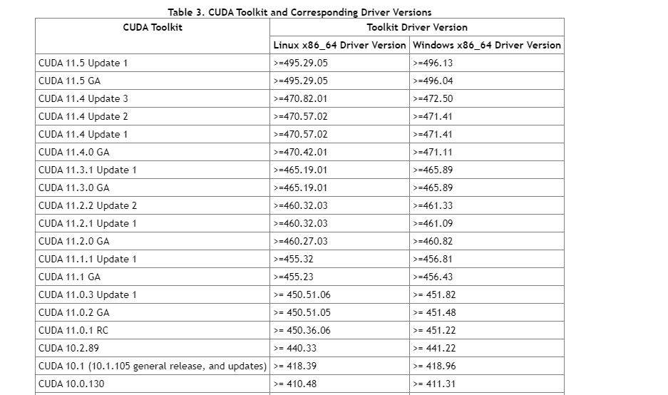
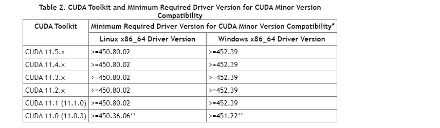
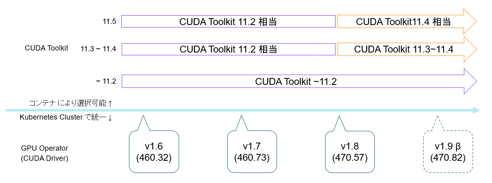

Kubernetes で NVIDIA の GPU を使うときのお話です。


## サマリ

- NVIDIA GPU Operator を使うと Kubernetes で NVIDIA GPU を使うときのセットアップが簡単になるよ。
- コンテナによって、 CUDA Toolkit のバージョンを変えられるので、環境変数で切り替えたりしなくてよくなるよ。


## イントロ

NVIDIA の GPU を使うときは、 CUDA と呼ばれるソフトウェアを使用することが一般的と思います。

その CUDA は 主に、 Driver と Toolkit で成り立っており、「GPUの型番」、「Driverのバージョン」、「Toolkitのバージョン」の
整合性があっていないと、利用できない代物です。

また、機械学習のライブラリでは、要件となる Toolkit のバージョンが決まっており、決められたバージョン以上の Toolkit を
使用できる環境を準備するのが望ましいです。
たとえば、 PyTorch の最新 v1.10 では CUDA Toolkit 11.3 、 TensorFlow の最新 v2.7.0 では、 CUDA Toolkit 11.2 となっています。

## コンテナで NVIDIA GPU を使うには

CUDA はハードウェアにも密接に関連するソフトウェアです。それをコンテナで使用する場合のインストール先のすみ分けは以下のようになります。

- CUDA Toolkit はコンテナにインストール
- CUDA Driver はホストにインストール



そして、コンテナを起動するときに、 Driver などを利用可能にしてくれるのが、 NVIDIA Container Toolkit というソフトウェアです。
(名前が紛らわしいかもしれませんが、CUDA Toolkit とは別物です。)

さらに、Kubernetes で CUDA を使って、マニフェストで、 GPU を `resource` 指定できるようにするために、 NVIDIA device plugin が必要です。


## NVIDIA GPU Operator

ここまでの複雑なセットアップを簡易にしたのが [NVIDIA GPU Operator](https://docs.nvidia.com/datacenter/cloud-native/gpu-operator/overview.html) です。

NVIDIA GPU Operator は、 Helm でインストールでき、インストールすると、 `ClusterPolicy` という Custom Resource が定義されます。
ClusterPolicy をデプロイすると、GPUの利用に必要な以下のコンポーネントが DaemonSet として起動します。

- **Node Feature Discovery**: Kubernetes の各ノードの情報をノードの label に付与してくれます。この label で NVIDIA の GPU が搭載されているノードを特定できます。
- **NVIDIA Driver DaemonSet**: ノードのディレクトリをマウントして、 Driver をインストールしてい（ると思い）ます。
- **NVIDIA Container Toolkit**: Driver をコンテナにマウントしたりします。
- **NVIDIA Device Plugin**: Pod から要求されたリソースを割り当てたりします。
- **GPU Feature Discovery**: ノードで利用可能なGPUの情報をノードの label に付与してくれます。
- **NVIDIA DCGM(Data Center GPU Manager) Exporter**: GPU の使用状況をモニタリング・収集し、Prometheus などで利用可能なように公開しています。


これにより、ノード側のGPUのセットアップは完了し、手動での、Driverのインストール などは不要になります。

あとは、Pod で以下のように、 resource 指定をすれば、 Pod で GPU が使用できます。

```yaml
resources:
  limits:
    nvidia.com/gpu: 1
```

なお、GPUは `limit` でのみ指定されることが想定されています。この制限は、次のことを意味します。

- Kubernetesはデフォルトで`limits`の値を`requests`の値として使用するため、GPUの`requests`を省略して`limits`を指定できます。
- GPUを`limits`と`requests`の両方で指定できるが、これら2つの値は等しくなければなりません。
- GPUの`limits`を省略して`requests`だけを指定することはできません。


## Kubernetes での GPU 利用時の制限

GPU Operator で GPU を使えるようになりますが、以下の制限があります。

- コンテナ(およびPod)はGPUを共有できません。GPUのオーバーコミットはできません。
    - Kubernetesでない環境では、複数プロセスでGPUを使用することができますが、
      Kubernetes では、GPUをリソース `limits` で指定するために、オーバーコミットができなくなります。
- 各コンテナは1つ以上のGPUをリクエストできます。1つのGPUの一部だけをリクエストすることはできません。
    - CPUのように小数で指定することはできません。

このように、Kubernetes では、GPU を必要以上に割り当ててしまう懸念があります。

NVIDIA GPU の Ampere シリーズでは、この課題に対処するため、1つのGPUを複数のGPUに分割する [Multi Instance GPU (MIG)](https://docs.nvidia.com/datacenter/tesla/mig-user-guide/) という機能があります。
MIG は GPU Operator でも利用することができます。(この記事では、MIGの詳細は割愛いたします)


## CUDA の互換性

CUDA Driver は上記の通り、GPU Operator によってセットアップされるため、 Kubernetes Cluster で統一されたバージョンとなります。




そして、CUDA Driver と、コンテナにセットアップする CUDA Toolkit には以下の互換性があります。

- 第一に、ある CUDA Toolkit バージョンのすべての機能を利用するために必要な CUDA Driver のバージョンが決まっています。
    - たとえば、最新の CUDA Toolkit 11.5 を Linux で使用したい場合、 CUDA Driver の 495.29.05 以上が必要ということになります。
    - 見方を変えると、最新の CUDA Driver でも、 多少古い CUDA Toolkit は使用できるということになります。
        - (限度はありますが、ひとまず、よほど古くなければ大丈夫くらいで、この場はスルーさせてください)



- 第二に、CUDA Toolkit は機能を制限することを条件に、多少古い CUDA Driver でも利用することができます。
    - 最新の CUDA Toolkit 11.5 では、すべての機能を使うためには、 Driver 495.29.05 が必要ですが、Linux では Driver 450.80.02 があれば、
      Toolkit 11.2 相当の機能で動作することができます。



基本的に、 CUDA Driver のバージョンが新しいことにデメリットはありませんので、 GPU Operator も最新のバージョンを利用することが良いと思います。


## 併用可能な CUDA のバージョン

まとめると GPU Operator を使用すると、以下のように、複数バージョンの CUDA Toolkit が、環境変数の変更等なしに 利用できます。




## 異なる CUDA Toolkit の利用 (コンテナなしの場合)

参考までに、コンテナを使用しない環境で、複数の CUDA Toolkit を利用したい際には、

OS に複数の CUDA Toolkit をインストールし、以下の要領で使用する CUDA Toolkit のバージョンを切り替えることができます。

- 環境変数 `LD_LIBRARY_PATH` で 使用する CUDA Toolkit を指定します。
    - たとえば、 `/usr/local/cuda-11.2/lib64` と `/usr/local/cuda-11.3/lib64` を切り替えて使う方法です。
- 環境変数 `LD_LIBRARY_PATH` は `/usr/local/cuda/lib64` で固定し、 `update-alternatives` コマンドで切り替える方法です。
    - この方法だと、複数バージョンの同時利用は難しそうです。


## 参照

- [NVIDIA CUDA Toolkit Release Notes](https://docs.nvidia.com/cuda/cuda-toolkit-release-notes/index.html)
- [GitHub - NVIDIA Container Toolkit](https://github.com/NVIDIA/nvidia-docker)
- [GitHub - NVIDIA GPU Operator](https://github.com/NVIDIA/gpu-operator)
- [NVIDIA GPU Operator](https://docs.nvidia.com/datacenter/cloud-native/gpu-operator/overview.html)
- [Kubernetes - GPUのスケジューリング](https://kubernetes.io/ja/docs/tasks/manage-gpus/scheduling-gpus/)
- [NVIDIA Multi-Instance GPU User Guide](https://docs.nvidia.com/datacenter/tesla/mig-user-guide/)


