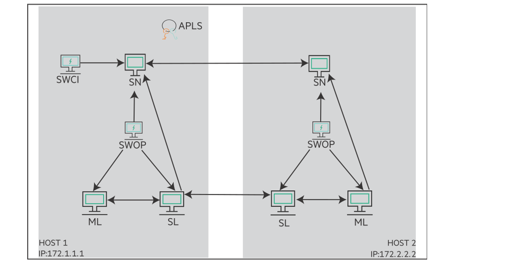
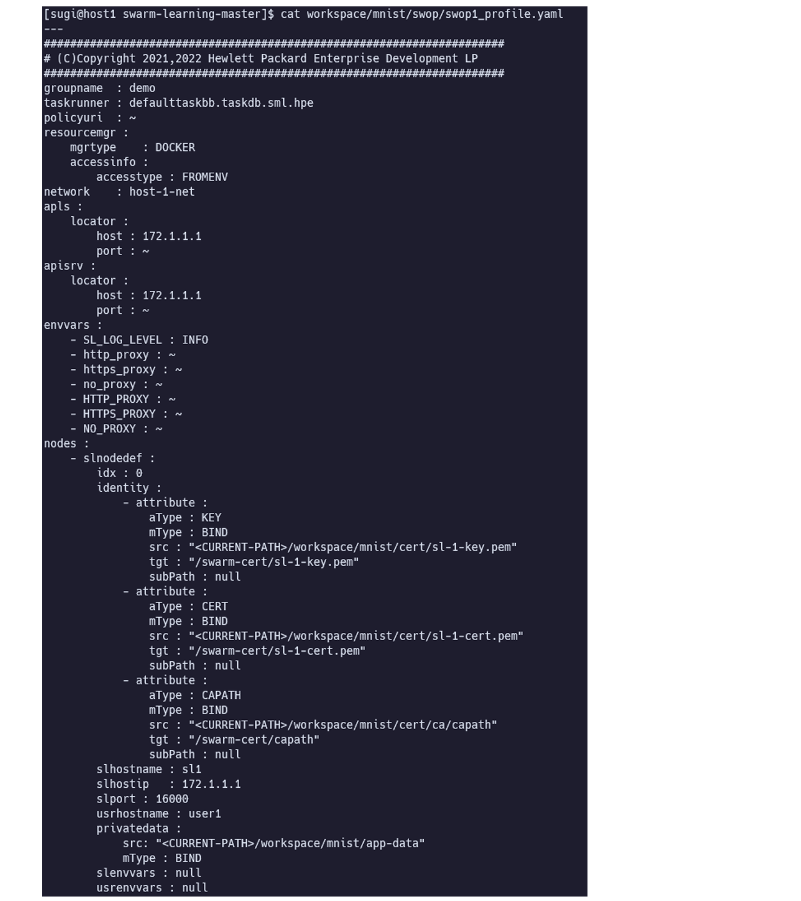
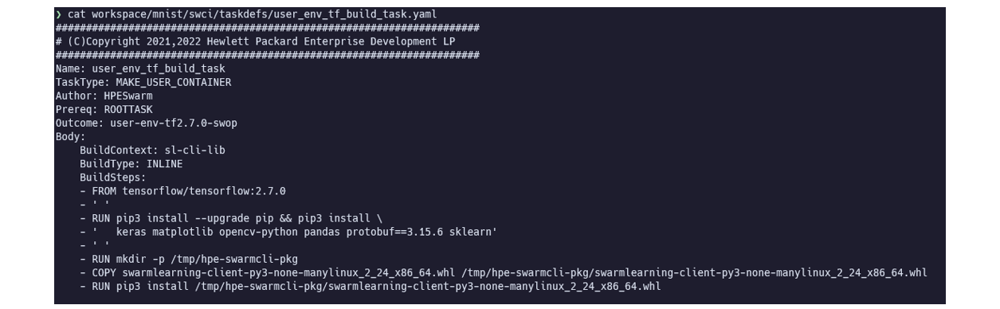
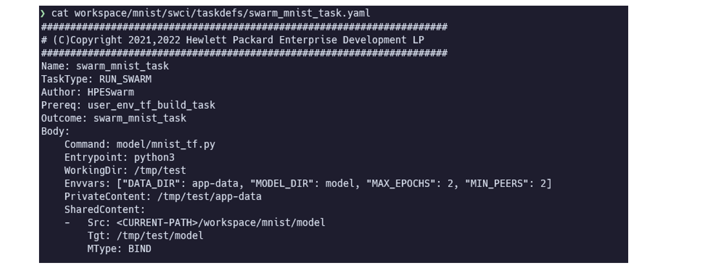
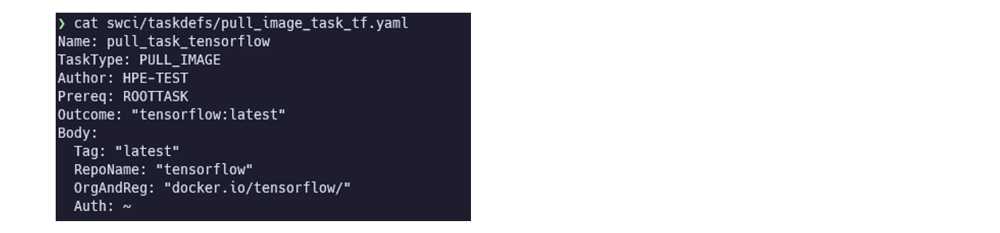
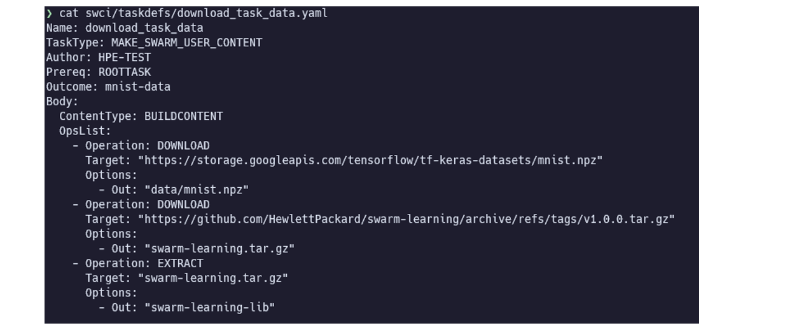
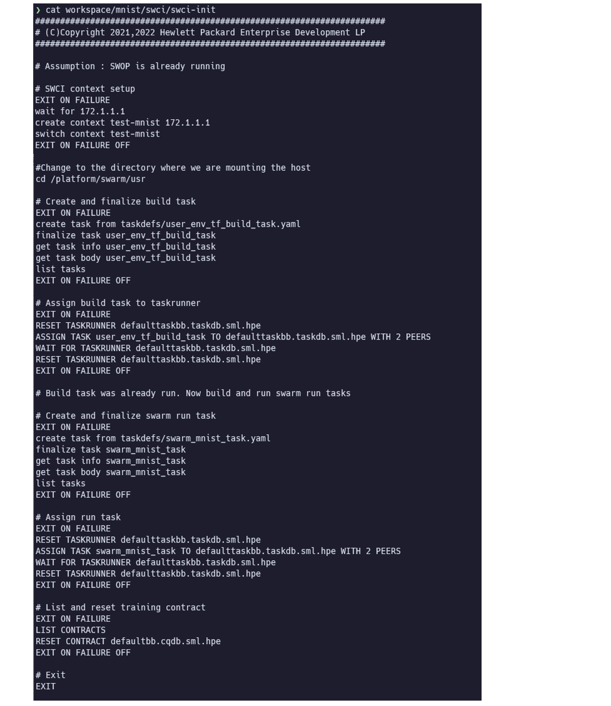
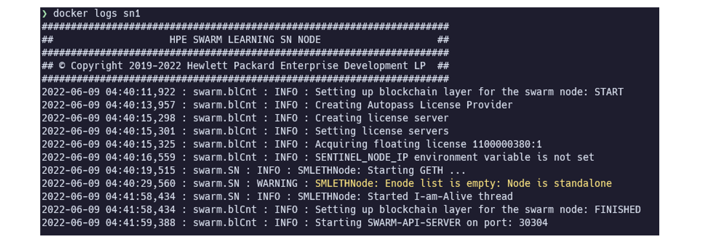

[前回](../hpe-swarm-learning-install/) に引き続き、Swarm Learning の使い方をご紹介します。

この記事に登場する略語(SN や APLS など)の説明は[前々回](../hpe-swarm-learning-intro/)の記事をご参照ください。

<!-- START doctoc generated TOC please keep comment here to allow auto update -->
<!-- DON'T EDIT THIS SECTION, INSTEAD RE-RUN doctoc TO UPDATE -->

- [チュートリアル Keras MNIST](#%E3%83%81%E3%83%A5%E3%83%BC%E3%83%88%E3%83%AA%E3%82%A2%E3%83%AB-keras-mnist)
  - [事前準備](#%E4%BA%8B%E5%89%8D%E6%BA%96%E5%82%99)
  - [SWOP Profile 設定](#swop-profile-%E8%A8%AD%E5%AE%9A)
  - [SWOP Task 設定](#swop-task-%E8%A8%AD%E5%AE%9A)
    - [Docker コンテナイメージビルド Task](#docker-%E3%82%B3%E3%83%B3%E3%83%86%E3%83%8A%E3%82%A4%E3%83%A1%E3%83%BC%E3%82%B8%E3%83%93%E3%83%AB%E3%83%89-task)
    - [学習実行 Task](#%E5%AD%A6%E7%BF%92%E5%AE%9F%E8%A1%8C-task)
    - [Docker イメージプル Task](#docker-%E3%82%A4%E3%83%A1%E3%83%BC%E3%82%B8%E3%83%97%E3%83%AB-task)
    - [ファイルダウンロード Task](#%E3%83%95%E3%82%A1%E3%82%A4%E3%83%AB%E3%83%80%E3%82%A6%E3%83%B3%E3%83%AD%E3%83%BC%E3%83%89-task)
  - [SWCI 実行処理設定](#swci-%E5%AE%9F%E8%A1%8C%E5%87%A6%E7%90%86%E8%A8%AD%E5%AE%9A)
    - [SWCI コンテキスト](#swci-%E3%82%B3%E3%83%B3%E3%83%86%E3%82%AD%E3%82%B9%E3%83%88)
    - [SWCI コントラクト](#swci-%E3%82%B3%E3%83%B3%E3%83%88%E3%83%A9%E3%82%AF%E3%83%88)
    - [SWCI タスクランナー](#swci-%E3%82%BF%E3%82%B9%E3%82%AF%E3%83%A9%E3%83%B3%E3%83%8A%E3%83%BC)
    - [SWCI 設定概要](#swci-%E8%A8%AD%E5%AE%9A%E6%A6%82%E8%A6%81)
  - [SN 起動](#sn-%E8%B5%B7%E5%8B%95)
  - [SWOP 起動](#swop-%E8%B5%B7%E5%8B%95)
  - [SWCI 起動](#swci-%E8%B5%B7%E5%8B%95)
  - [Swarm Learning 停止](#swarm-learning-%E5%81%9C%E6%AD%A2)
- [Swarm Learning ライブラリ](#swarm-learning-%E3%83%A9%E3%82%A4%E3%83%96%E3%83%A9%E3%83%AA)
  - [Tensorflow (Keras)](#tensorflow-keras)
  - [PyTorch](#pytorch)
- [まとめ](#%E3%81%BE%E3%81%A8%E3%82%81)
- [参照](#%E5%8F%82%E7%85%A7)

<!-- END doctoc generated TOC please keep comment here to allow auto update -->


## チュートリアル Keras MNIST

このチュートリアルでは、MNIST をSwarm Learningで実行します。Deep LearningのライブラリとしてKerasを使用します。
実行するコードは、[こちら](https://www.tensorflow.org/tutorials/quickstart/beginner) から引用し、Swarm Learning上で動作するように修正したものです。
以下のような環境となっています。

- 2つの SN を使用します。 `host-1` を Sentinel Node として、最初に起動します。
- SL と ML は、学習開始時に、SWOP によって自動的に作成され、学習後に削除されます。
- 学習は `host-1` の SWCI によって開始されます。



この記事のチュートリアルでは、特に断りがない限り、前回 Swarm Learning をインストールしたディレクトリ
`/opt/hpe/swarm-learning` にて作業を行っています。

> 実運用においては、Swarm Learning がインストールされたディレクトリ `/opt/hpe/swarm-learning` ではなく、
> 一般ユーザーにて、操作できるディレクトリにて、作業を行うことが望ましいと思われます。

### 事前準備

1. 学習に使用するデータセットをダウンロードします。

```
curl https://storage.googleapis.com/tensorflow/tf-keras-datasets/mnist.npz \
-o examples/mnist/app-data/mnist.npz
```

2. 一時的なワークスペース・ディレクトリを作成し、サンプルコードをコピーします。

```
mkdir workspace
cp -r examples/mnist workspace/
cp -r examples/utils/gen-cert workspace/mnist/
```

3. Swarm Learningの各コンポーネントが相互に通信する際に使用するTLS証明書を作成します

> ここでは、Swarm Learningに同梱されているツールでTLS証明書を生成しますが、
> 本番環境導入にあたっては、正規の情報に基づくTLS証明書を作成するのが良いと思われます。

- host-1
```
./workspace/mnist/gen-cert -e mnist -i 1
```

- host-2
```
./workspace/mnist/gen-cert -e mnist -i 2
```

4. 作成したCA証明書を相互に交換します。

- host-1
```
scp <host-2>:<PATH>workspace/mnist/cert/ca/capath/ca-2-cert.pem \
workspace/mnist/cert/ca/capath
```

- host-2
```
scp <host-1>:<PATH>workspace/mnist/cert/ca/capath/ca-1-cert.pem \
workspace/mnist/cert/ca/capath
```

5. Swarm Learning のコンポーネントが使用するDockerネットワークを作成します。

- host-1
```
docker network create host-1-net
```

- host-2
```
docker network create host-2-net
```

6. Docker ボリュームを作成し、Swarm Learning のライブラリを格納します。

MLのDockerコンテナイメージをビルドする際に、このボリュームをマウントし、Swarm LearningライブラリをMLにインストールします。

```
docker volume create sl-cli-lib
docker container create --name helper -v sl-cli-lib:/data \
hub.myenterpriselicense.hpe.com/hpe_eval/swarm-learning/sn:1.0.0
docker cp -L lib/swarmlearning-client-py3-none-manylinux_2_24_x86_64.whl helper:/data
docker rm helper
```


### SWOP Profile 設定

SWOPのProfileを確認・設定します。SWOPはProfileの内容に沿って、タスクの実行やSLの起動などを行います。
このチュートリアルでは、`host-1` は `swop1_profile.yaml` を、`host-2` は、 `swop2_profile.yaml` を使用します。



SWOPのProfileにて、以下の点を更新します。

* `<CURRENT-PATH>` をカレントディレクトリ(フルパス)に置換します。
* APLS(`apls`)、SN(`apisrv`)、SL(`slhostip`) のIPアドレスが異なる場合は、更新します。
* インターネット接続にあたりProxy設定が必要な場合は、 `envvars` に設定します。

主要な設定項目は以下となります。

* `slnodedef` でSWOPが起動するSLの設定をします。起動したいSLの数だけ、 `slnodedef` を記載する必要があります。
* `slnodedef.identity` に、SL間の通信で使用するTLS証明書を記載します。
* `slnodedef.privatedata` に、学習で使用するデータが格納されているディレクトリもしくはボリュームを指定できます。マウント先のディレクトリは後述の `RUN_SWARM` task 内で指定します。（MLにマウントされます）
* `slnodedef.userenvvars` に、学習で使用する環境変数を指定できます。以下は例です。

``` yaml
      usrenvvars:
        - NODE_WEIGHTAGE: 80
```

* `slnodedef.usercontaineropts` に、MLの起動オプションを指定できます。MLでGPUを使用する場合、ここにオプションを追加します。以下は例です。

``` yaml
      usrcontaineropts:
        - gpus: "all"
```

``` yaml
      usrcontaineropts:
        - gpus: "device=6,7"
```

その他、SWOP Profileで設定できる項目 (Schema) は、 `docs/SWOP-profile-schema.yaml` に記載されています。


### SWOP Task 設定

SWOPが実行するTaskを確認・設定します。これらのファイルでSWOPが行うTaskの詳細を設定します。
これらのファイルは、SWCIから呼び出されるため、ファイルが格納されているディレクトリは `swci` のディレクトリとなります。


SWOP Taskで設定できる項目 (Schema) は、 `docs/SWOP-task-schema.yaml` に記載されています。

#### Docker コンテナイメージビルド Task



Dockerコンテナのビルドを行うタスクの設定です。

- `TaskType` は `MAKE_USER_CONTAINER` を指定します。
- `Prereq` に、前提となるタスクを記載します。 `ROOTTASK` は初期タスクで、前提がないことを示しています。
- `Outcome` に記載した名称のコンテナイメージが作成されます。
- `BuildContext` に記載したDockerボリュームをベースにコンテナイメージのビルドが行われます。このボリュームは事前にユーザーが手動で作成しておく必要があります。
- `BuildType: INLINE` はビルドのステップを `BuildSteps` で記載することを意味しています


#### 学習実行 Task



学習を行うタスクです。

- `TaskType` は `RUN_SWARM` を指定します。
- `PrivateContent` は、SWOP Profile で指定した `slnodedef.privatedata` のマウント先ディレクトリを指定します。
- `SharedContent` は、各システム共通でマウントするディレクトリもしくはボリュームを指定します。学習済みモデルの保存先などを指定することが想定されています。


#### Docker イメージプル Task



Docker イメージをプルするTaskです。

- `TaskType` は `PULL_IMAGE` を指定します。
- `OrgAndReg` は Dockerイメージを含む Organization と Registry を指定します。
- `RepoName` は Docker イメージを含む レポジトリの名前を指定します。
- `Tag` はDocker イメージのタグを指定します。
- `Auth` は プライベートなレジストリにアクセスする際に使用する認証情報を指定します。認証情報には以下の情報を使用できます。
    * Docker の `config.json` のファイルパス
    * レジストリへのログインユーザー名とパスワード


#### ファイルダウンロード Task



特定のURLからデータをダウンロード（解凍）する Task です。ダウンロード（解凍）したファイルはDocker のVolume に保存されます。
Dockerイメージのビルドや、学習に使用することを想定しています。

- `TaskType` は `MAKE_SWARM_USER_CONTENT` を指定します。
- `ContentType` は `BUILDCONTENT` もしくは `SWARMCONTENT` を指定します。それぞれ以下のような動作となります。
    * `BUILDCONTENT` は、Dockerのビルドを想定した `ContentType` で、各SWOPにつき1つ、Volume が作成されます。
    * `SWARMCONTENT` は、学習に使用することを想定した `ContentType` で、各SLにつき1つ、Volume が作成されます。
- `Outcome` に指定した名称の Volume が作成されます。 `ContentType` が `SWARMCONTENT` の場合は、末尾に、連番が追加で付与されます。
- `OpsList` には、ダウンロード（解凍する）データの情報を記載します。
- `Operation` は `DOWNLOAD` もしくは、 `EXTRACT` を指定します。それぞれ以下のような動作となります。
    * `DOWNLOAD` はファイルをダウンロードするTaskです。
    * `EXTRACT` はダウンロード済みのファイル（ tar アーカイブ）を解凍する Task です。
- `Target` は、ダウンロード（解凍）する元となるファイルのURLもしくは、ファイルパスです。
- `Options.Out` は、ファイルの出力先の（Docker Volume内の）ファイルパスです。


### SWCI 実行処理設定

SWCI 起動時に実行する処理を設定します。



#### SWCI コンテキスト

SWCI コンテキストは、文字列の識別子です。SWCI コマンドの実行先環境を識別します。
SWCIは、複数のコンテキストを作成できますが、操作が可能なアクティブなコンテキストは常に1つとなります。

#### SWCI コントラクト

SWCIコントラクトは、Swarm Learningの学習プロセスを制御するために使用されます。
これはブロックチェーンEthereumスマートコントラクトのインスタンスです。
`CREATE CONTRACT`コマンドなどを使用してブロックチェーンにデプロイされ、Swarm Learning Networkに登録されます。
SWCI コントラクトは、一度永続化されると、更新・削除することはできません。
コンテキストが作成されると、デフォルトのコントラクト `defaultbb.cqdb.sml.hpe` が合わせて作成されます。

#### SWCI タスクランナー

タスクランナーは、SWOPによるタスクの実行を調整するために使用されるEthereumスマートコントラクトのインスタンスです。
コンテキストが作成されると、デフォルトのタスクランナー `defaulttaskbb.taskdb.sml.hpe` が合わせて作成されます。

#### SWCI 設定概要

- SWCI は処理途中でエラーが発生しても、後続の処理は中断せず、継続されます。
- `EXIT ON FAILURE` ~ `EXIT ON FAILURE OFF` で処理を囲むことで、この範囲内でタスクがエラーとなった場合、後続の処理は実行されず、中断します。
- `CREATE CONTEXT`: SWCI コンテキストを作成します。
- `SWITCH CONTEXT`: アクティブなコンテキストを切り替えます。
- `CREATE TASK FROM`: タスク定義ファイルを読み込み、タスクを作成し、Swarm Learning Network に登録します。(この時点では、まだタスクの変更・削除は可能です)
- `FINALIZE TASK`: タスクをブロックチェーン上で永続化します。永続化されたタスクは変更・削除できません。
- `RESET TASKRUNNER`: タスクランナーの状態がリセットされ、初期化前の状態に戻ります。
- `ASSIGN TASK`: タスクが指定されたタスクランナーに割り当てられ、実行されます。その際、期待する ピア の数を指定します。指定すべきピアの数はタスクの種類によって、以下の通りとなります。
    * `RUN_SWARM` タスクの場合、起動するSLの数。
    * その他のタスクの場合、起動するSWOP の数。
- `WAIT FOR TASKRUNNER`: 指定されたタスクランナーで実行されているタスクが完了するのを待ちます。
- `RESET CONTRACT`: コントラクトの状態を初期化されていない状態にリセットします。学習が完了したコントラクトを再利用して、新しい学習を開始したい場合などに使用します。


### SN 起動

ブロックチェーンを構成するSNを起動します。

初めに、`host-1` の SN (Sentinel Node) を起動します。

- host-1

```
./scripts/bin/run-sn -d --rm --name=sn1 --network=host-1-net --host-ip=172.1.1.1 \
--sentinel --sn-p2p-port=30303 --sn-api-port=30304 \
--key=workspace/mnist/cert/sn-1-key.pem \
--cert=workspace/mnist/cert/sn-1-cert.pem \
--capath=workspace/mnist/cert/ca/capath \
--apls-ip=172.1.1.1
```

- `--sentinel` オプションは、起動するSNが Sentinel Node であることを示すものです。

SN起動後、ログに以下の内容が出力されれば初期化完了となり、次のステップに進めます。数分程度を要します。

```
Starting SWARM-API-SERVER on port: 30304
```



つづけて、残りの他のノードでSNを起動します。

- host-2

```
./scripts/bin/run-sn -d --rm --name=sn2 --network=host-2-net --host-ip=172.2.2.2 \
--sentinel-ip=172.1.1.1 --sn-p2p-port=30303 --sn-api-port=30304 \
--key=workspace/mnist/cert/sn-2-key.pem \
--cert=workspace/mnist/cert/sn-2-cert.pem \
--capath=workspace/mnist/cert/ca/capath \
--apls-ip=172.1.1.1
```

- `--sentinel-ip` オプションでは、Sentinel Node として起動したSNのIPアドレスを指定します。

SN起動後、ログに以下の内容が出力されれば初期化完了となり、次のステップに進めます。数分程度を要します。

```
Starting SWARM-API-SERVER on port: 30304
```


### SWOP 起動

タスクの実行を管理するSWOPを起動します。起動時に、各システムそれぞれの状況に応じたSWOP Profileを指定します。

- host-1

```
./scripts/bin/run-swop -d --rm --name=swop1 --network=host-1-net \
--usr-dir=workspace/mnist/swop --profile-file-name=swop1_profile.yaml \
--key=workspace/mnist/cert/swop-1-key.pem \
--cert=workspace/mnist/cert/swop-1-cert.pem \
--capath=workspace/mnist/cert/ca/capath \
-e http_proxy= -e https_proxy= --apls-ip=172.1.1.1
```

- host-2

```
./scripts/bin/run-swop -d --rm --name=swop2 --network=host-2-net \
--usr-dir=workspace/mnist/swop --profile-file-name=swop2_profile.yaml \
--key=workspace/mnist/cert/swop-2-key.pem \
--cert=workspace/mnist/cert/swop-2-cert.pem \
--capath=workspace/mnist/cert/ca/capath \
-e http_proxy= -e https_proxy= --apls-ip=172.1.1.1
```

- `--user-dir`: SWOP Profile が配置されたディレクトリを指定します。指定されたディレクトリ直下にSWOP Profileのファイルが配置されている必要があります。
- `--profile-file-name`: SWOP Profile のファイル名です。

SWOPは起動に、ほとんど時間を必要としません。ログには、指定したProfileの内容と合わせて、以下のような内容が出力されます。

＜前略＞


### SWCI 起動

タスクの実行を指示するSWCIを起動します。これにより、指定されたタスクが順次実行されます。

- host-1

```
./scripts/bin/run-swci -ti --rm --name=swci1 --network=host-1-net \
--usr-dir=workspace/mnist/swci --init-script-name=swci-init \
--key=workspace/mnist/cert/swci-1-key.pem \
--cert=workspace/mnist/cert/swci-1-cert.pem \
--capath=workspace/mnist/cert/ca/capath \
-e http_proxy= -e https_proxy= --apls-ip=172.1.1.1
```

- `--user-dir`: SWCI Init ファイル が配置されたディレクトリを指定します。指定されたディレクトリ直下にSWCI Initのファイルが配置されている必要があります。
- `--init-script-name`: SWCI Init のファイル名です。

SWCIを実行すると、SWCIのプロンプトに対して、 `swci-init` ファイルの内容が順次実行されていく様子が確認できます。


### Swarm Learning 停止

`swarm-learning/bin/stop-swarm` スクリプトを使用して、ホストシステム上で動作している
すべての Swarm Network および Swarm Learning コンポーネントを停止します。
このスクリプトは、自システム内のコンポーネントのみが操作対象となります。各システムごとに停止処理を行う必要があります。

```
./scripts/bin/stop-swarm
```

* `--all`: SL、SN、SWCI、SWOPのすべてを停止します。 `stop-swarm` で引数が省略された場合もこの動作となります。
* `--sl`: SL を停止します。
* `--sn`: SN を停止します。
* `--swci`: SWCI を停止します。
* `--swop`: SWOP を停止します。
* `--keep`: このパラメータを指定すると、停止したコンテナを保持します。デフォルトでは削除されます。


## Swarm Learning ライブラリ

ここでは、Tensorflow や PyTorch のコード内でどのようにSwarm Learning のライブラリを利用するかご紹介します。

Swarm Learning ライブラリには、`SwarmCallback` というカスタムコールバッククラスが実装されています。
`SwarmCallback`は、同期間隔ごとに各SLとモデルパラメータを共有する操作を実行します。


### Tensorflow (Keras)

TensorFlowベースのKerasプラットフォームでは、`SwarmCallback`は
Kerasの`tf.keras.callbacks.Callback`クラスをベースにしています。

学習コード冒頭で、ライブラリをインポートします。

```python
from swarmlearning.tf import SwarmCallback #for TensorFlow
```

`SwarmCallback` のインスタンスを作成します。

```python
swarmCallback = SwarmCallback(
    syncFrequency=128,
    minPeers=MIN_PEERS,
    useAdaptiveSync=False,
    adsValData=(x_test, y_test),
    adsValBatchSize=8,
    checkinModelOnTrainEnd=snapshot,
    nodeWeightage=50,
)
```

- `syncFrequency`: モデルを同期する周期です。指定されたバッチ数ごとにモデルのマージを行います。
- `minPeers`: モデルを同期するのに必要な最小のSLの数を指定します。
- `useAdaptiveSync`: 検証データのパフォーマンスに基づいて、モデル同期後の次の `syncFrequency` 値を動的に変更する場合は `True` とします。
- `adsValData`: `useAdaptiveSync` の調整に使用するデータを指定します。
- `adsValBatchSize`: `adsValData` を評価する際のバッチサイズを指定します。
- `checkinModelOnTrainEnd`: 学習が終了した時点でローカルに存在する最後のモデルの重みをマージするかどうかを指定します。
    * `inactive`: ノードはマージ処理に重みを提供しませんが、マージ処理に非貢献ピアとして(`minPeers`を満たすために)参加します。
    * `snapshot`:ノードは学習終了時点の重みを提供し、マージされた重みを受け入れません。(デフォルト値)
    * `active`: ノードは学習終了時点の重みを提供し、マージされた重みを採用します。
- `nodeWeightage`: マージ処理において、このノードの相対的な重要度を示す1～100の数値です。デフォルト値は、すべてのノードが等しく、同じ重み付け1となっています。

Keras学習コード内のコールバックのリストに`SwarmCallback`のインスタンスを渡します。クラスメソッドは自動的に呼び出されます。

```python
model.fit(..., callbacks = [swarmCallback])
```


### PyTorch

Kerasとは異なり、PyTorchには組み込みの`Callback`クラスがありません。
そのため、PyTorchベースの学習コードでは、ユーザーがこのクラスのメソッドを呼び出す必要があります。

学習コード冒頭で、ライブラリをインポートします。

```python
from swarmlearning.pyt import SwarmCallback #for PyTorch
```

`SwarmCallback` のインスタンスを作成します。

```python
swarmCallback = SwarmCallback(
    syncFrequency=128,
    minPeers=MIN_PEERS,
    useAdaptiveSync=False,
    adsValData=testDs,
    adsValBatchSize=8,
    checkinModelOnTrainEnd=snapshot,
    nodeWeightage=50,
    model=model,
)
```

パラメータは、Tensorflow のときと基本的に同じです。一点、PyTorchでは、モデルのインスタンスを引数に指定する必要があります。

PyTorchの場合、クラスメソッドを学習の中で適宜、呼び出す必要があります。

- モデルの学習を開始する前に `on_train_begin()` を呼び出す。
```python
swarmCallback.on_train_begin()
```

- 各バッチ学習終了後、 `on_batch_end()` を呼び出す。
```python
swarmCallback.on_batch_end()
```

- 各エポック学習終了後に `on_epoch_end()` を呼び出す。
```python
swarmCallback.on_epoch_end(epoch)
```

- モデル学習終了後、 `on_train_end()` を呼び出す。
```python
swarmCallback.on_train_end()
```


## まとめ

以上で Swarm Learning 使ってみた、の記事完結です。

その他の、Swarm Learning についての情報は、また別途、記事にしていけたらと思います。


その他の Swarm Learning の記事はこちら(に追加されていく予定)です。

- [Tags - HPE Swarm Learning](/tag/HPE%20Swarm%20Learning/)

## 参照

- [GitHub - HewlettPackard/swarm-learning](https://github.com/HewlettPackard/swarm-learning)
- [MY HPE SOFTWARE CENTER](https://myenterpriselicense.hpe.com/cwp-ui/auth/login)
