[前回](../hpe-swarm-learning-intro/) に引き続き、Swarm Learning のインストール方法をご紹介します。

この記事に登場する略語(SN や APLS など)の説明は[前回](../hpe-swarm-learning-intro/)の記事をご参照ください。


<!-- START doctoc generated TOC please keep comment here to allow auto update -->
<!-- DON'T EDIT THIS SECTION, INSTEAD RE-RUN doctoc TO UPDATE -->

- [Swarm Learning のライセンス](#swarm-learning-%E3%81%AE%E3%83%A9%E3%82%A4%E3%82%BB%E3%83%B3%E3%82%B9)
- [AutoPass License Server セットアップ](#autopass-license-server-%E3%82%BB%E3%83%83%E3%83%88%E3%82%A2%E3%83%83%E3%83%97)
  - [APLS ダウンロード](#apls-%E3%83%80%E3%82%A6%E3%83%B3%E3%83%AD%E3%83%BC%E3%83%89)
  - [APLS インストール](#apls-%E3%82%A4%E3%83%B3%E3%82%B9%E3%83%88%E3%83%BC%E3%83%AB)
  - [Swarm Learning ライセンスダウンロード](#swarm-learning-%E3%83%A9%E3%82%A4%E3%82%BB%E3%83%B3%E3%82%B9%E3%83%80%E3%82%A6%E3%83%B3%E3%83%AD%E3%83%BC%E3%83%89)
  - [Swarm Learning ライセンス登録](#swarm-learning-%E3%83%A9%E3%82%A4%E3%82%BB%E3%83%B3%E3%82%B9%E7%99%BB%E9%8C%B2)
- [Swarm Learning セットアップ](#swarm-learning-%E3%82%BB%E3%83%83%E3%83%88%E3%82%A2%E3%83%83%E3%83%97)
  - [Swarm Learning インストール](#swarm-learning-%E3%82%A4%E3%83%B3%E3%82%B9%E3%83%88%E3%83%BC%E3%83%AB)
  - [Swarm Learning ライブラリダウンロード](#swarm-learning-%E3%83%A9%E3%82%A4%E3%83%96%E3%83%A9%E3%83%AA%E3%83%80%E3%82%A6%E3%83%B3%E3%83%AD%E3%83%BC%E3%83%89)
- [次回へ](#%E6%AC%A1%E5%9B%9E%E3%81%B8)
- [参照](#%E5%8F%82%E7%85%A7)

<!-- END doctoc generated TOC please keep comment here to allow auto update -->


## Swarm Learning のライセンス

Swarm Learning のコミュニティ版ライセンスでは、各コンポーネント 5ノードまで起動することができます。

製品版との機能的な差異は基本的にないようです。
(製品版では、1組のSN群で複数の学習を並列実行できる、くらいかと思います。)

Swarm Learning のコンポーネントは基本的に、
コンポーネント起動時にライセンスを確保し、停止時にライセンスを解放します。


## AutoPass License Server セットアップ

Swarm Learningのライセンスを管理するAPLS(AutoPass License Server)をインストールし、
Swarm Learningのライセンスを登録します。

### APLS ダウンロード

1. [MY HPE SOFTWARE CENTER](https://myenterpriselicense.hpe.com/cwp-ui/auth/login) にアクセスします。
2. HPE Passport アカウントをお持ちの場合は、資格情報を入力し、サインインします。持っていない場合は、HPE Passport アカウントを作成し、Sign In してください。
3. サインイン後、左ペインから `ソフトウェア` をクリックします。

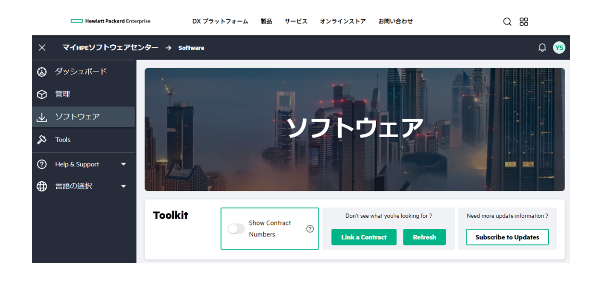

4. `検索`を探し、`検索タイプ`プルダウンから`Product Family`を選択し、`Autopass`を検索します。

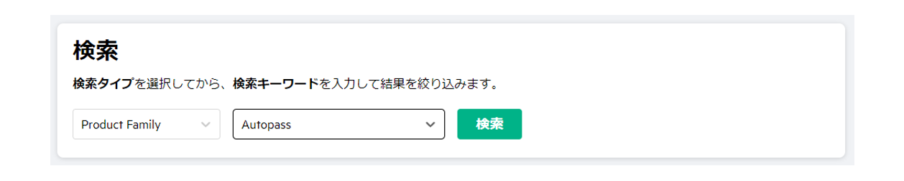

5. 検索結果には、利用可能なAutopass製品が一覧表示されます。
6. AutoPass License Server 9.10.2 を探し、`アクション` のプルダウンから `Get Downloads` をクリックします。

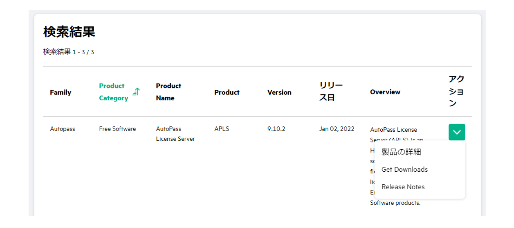

7. `ダウンロード`をクリックします。

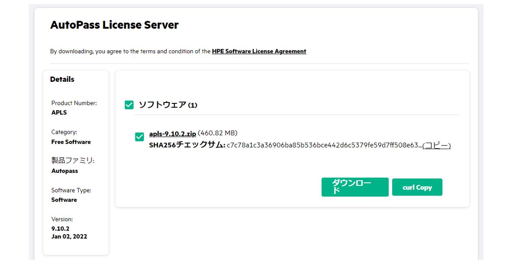


### APLS インストール

1. ダウンロードしたAPLSのパッケージ `apls-9.10.2.zip` を、APLSをインストールするシステムにアップロードします。
2. 作業用ディレクトリを作成し、パッケージを解凍します。以下のようなファイルが含まれているかと思います。

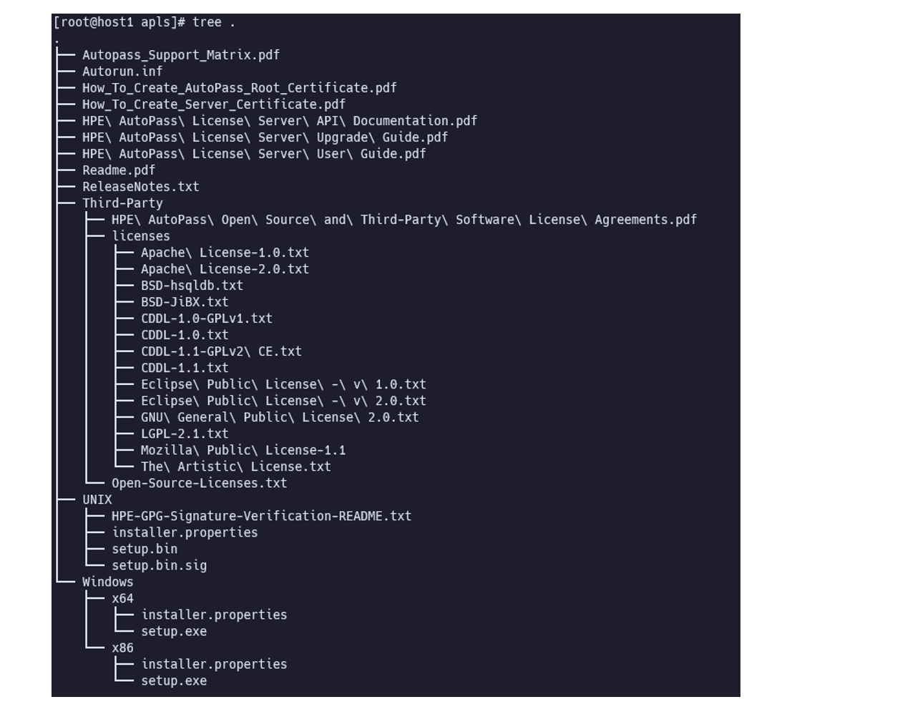

3. `UNIX` ディレクトリに移動し、インストーラーを起動します。

```
cd UNIX
chmod +x setup.bin
./setup.bin -i silent
```

プロンプトが返ってくればインストールは完了です。自動で APLS が起動します。

4. ブラウザを起動し、以下のURLで APLS に接続します。

```
https://<ip address or Host Name>:5814/autopass
```

TLS証明書の警告が表示される場合は、警告を無視して接続します。

ブラウザのバージョンに関する警告が表示される場合は、`OK` をクリックします。

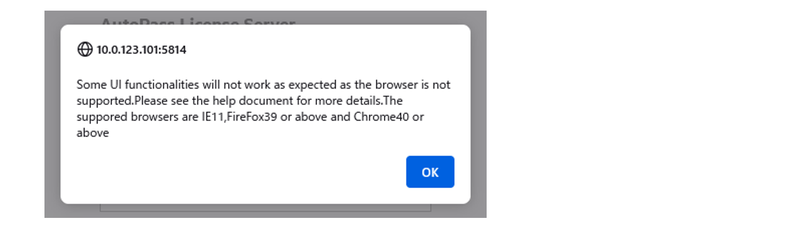

5. 以下の初期パスワードを入力し、`LOGIN`をクリックします。

- User Name: `admin`
- Password: `password`

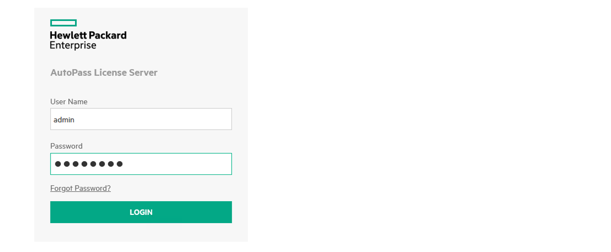

6. パスワードの更新を求められるので、任意のパスワードを設定します。


7. APLS の冗長性に関する警告が表示されますが、ここでは無視します。

APLSは2台で、Active - Standby の冗長構成を組むこともできます。

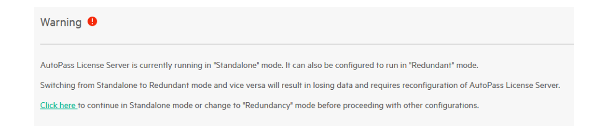

8. 画面上部の `LICENSE MANAGEMENT` をマウスオーバーし、その下に表示される `Install License` をクリックします。

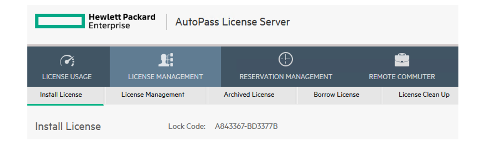

9. この画面に表示される Lock Code を控えておきます。

Swarm Learning のライセンス発行の際に必要となります。


### Swarm Learning ライセンスダウンロード

1. [MY HPE SOFTWARE CENTER](https://myenterpriselicense.hpe.com/cwp-ui/auth/login) にアクセスします。
2. HPE Passport アカウントをお持ちの場合は、資格情報を入力し、サインインします。持っていない場合は、HPE Passport アカウントを作成し、Sign In してください。
3. サインイン後、左ペインから `ソフトウェア` をクリックします。


4. `検索`を探し、`検索タイプ`プルダウンから`Product Family`を選択し、`AI Solutions SW`を検索します。

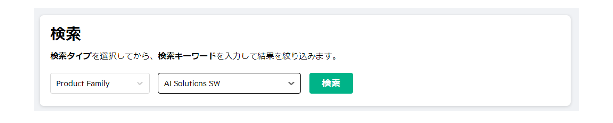

5. 検索結果には、利用可能なSwarm Learning製品が一覧表示されます。
6. HPE Swarm Learning Community edition NFRを探し、`アクション` のプルダウンから `Get License` をクリックします。

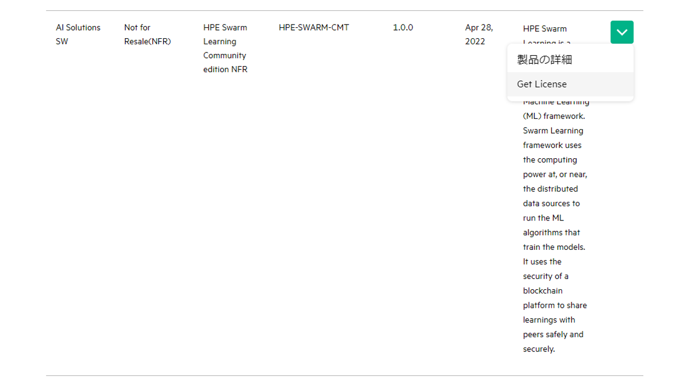

7. ソフトウェア利用規約を確認し、 `次へ` をクリックします。

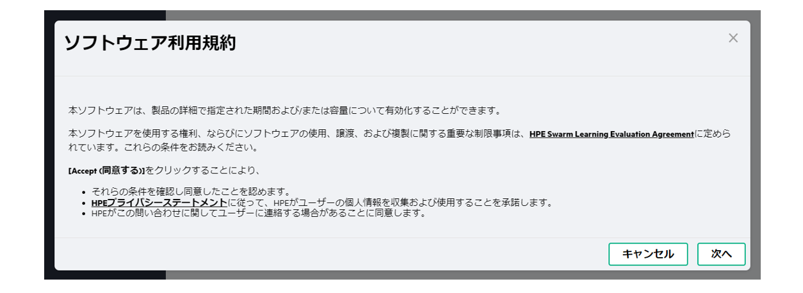

8. ステップ 3 の `HPE Serial Number` に 先程確認した APLS の Lock Code を入力し、`有効化`をクリックします。

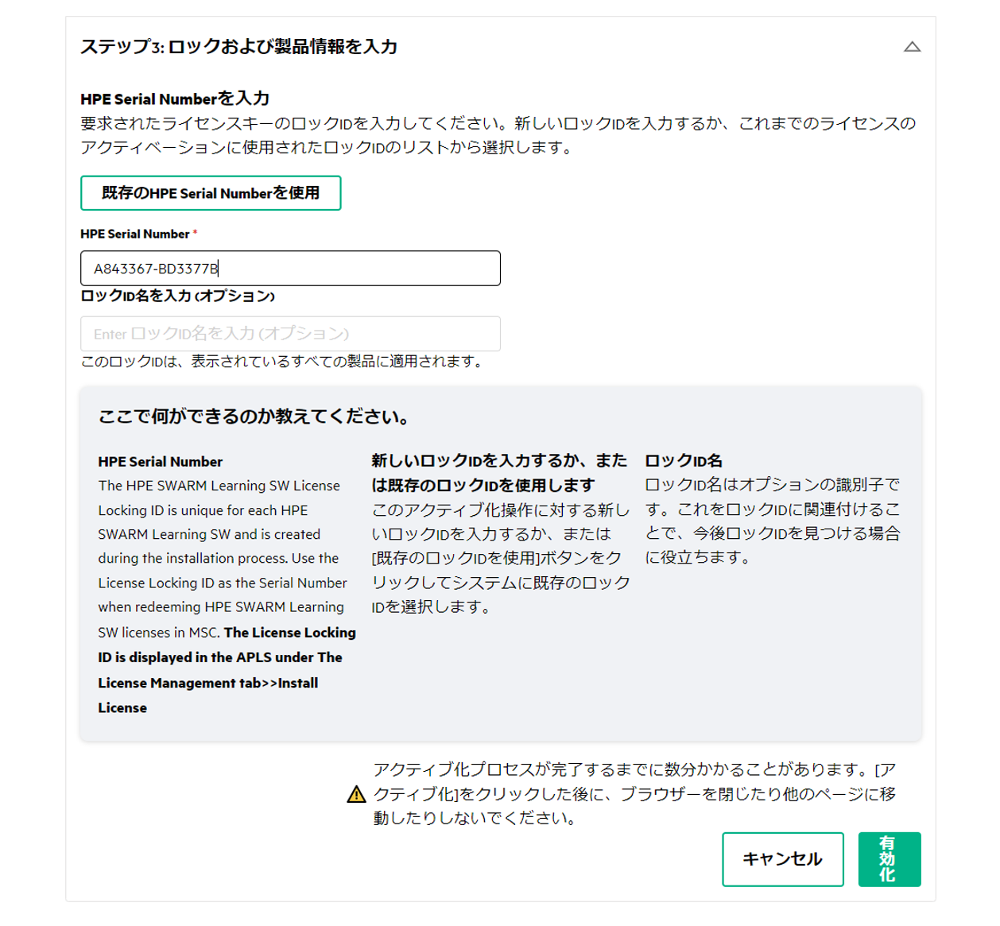

9. `Licenses Keys` 及び、`ソフトウェア`にチェックが入っていることを確認し、画面下部の `ダウンロード` をクリックします。
10. ライセンス及び、ソフトウェアがダウンロードされます。

ポップアップブロックにより、ダウンロードされないことがありますので、ご注意ください。

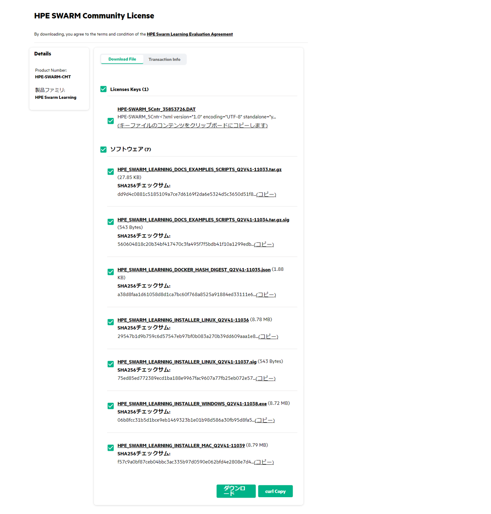


### Swarm Learning ライセンス登録

1. APLSにブラウザでアクセスし、`Install License` の画面を開きます。
2. `参照`をクリックし、先程ダウンロードしたSwarm Learning のライセンスファイルを選択します。`Next` をクリックします

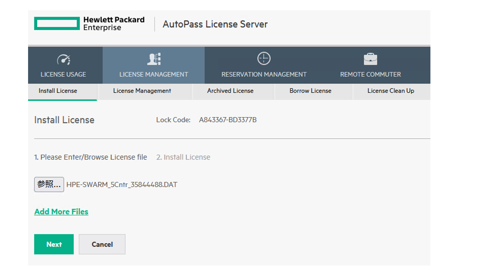

3. 表示されるライセンスをすべてチェックし、`Install Licenses` をクリックします。

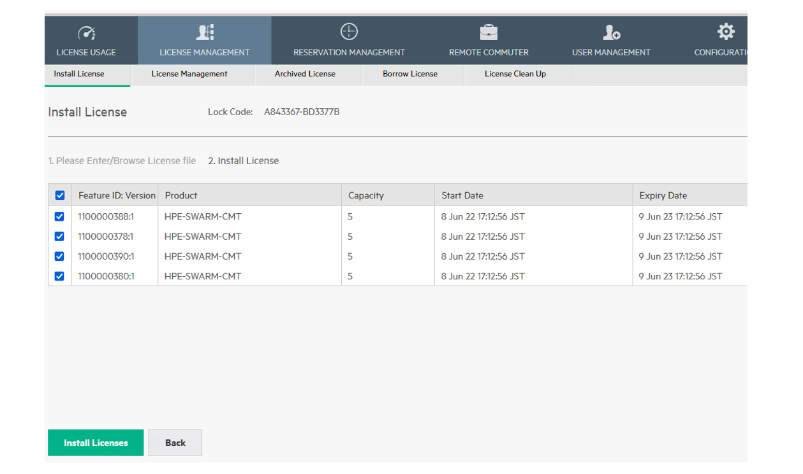

`4 License(s) added successfully.` と表示されれば、ライセンス登録成功です。

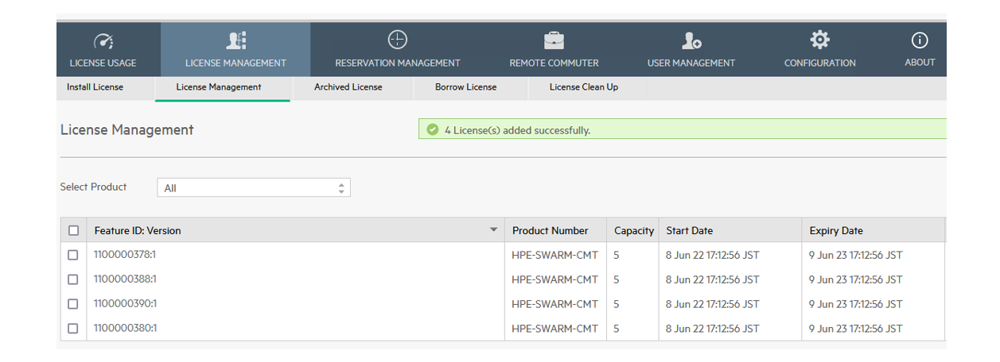


## Swarm Learning セットアップ

Swarm Learning を各システムにセットアップします。


### Swarm Learning インストール

1. ダウンロードした 以下のファイルをSwarm Learningの1システムにアップロードします。

* `HPE_SWARM_LEARNING_DOCKER_HASH_DIGEST_Q2V41-11035.json`
* `HPE_SWARM_LEARNING_DOCS_EXAMPLES_SCRIPTS_Q2V41-11033.tar.gz`
* `HPE_SWARM_LEARNING_DOCS_EXAMPLES_SCRIPTS_Q2V41-11034.tar.gz.sig`
* `HPE_SWARM_LEARNING_INSTALLER_LINUX_Q2V41-11036`

2. 以下のコマンドでインストーラーを起動します。

```
./HPE_SWARM_LEARNING_INSTALLER_LINUX_Q2V41-11036 -edition eval
```

3. ブラウザ経由でインストーラーにアクセスします。

インストーラーは127.0.0.1 のみでリッスンしているため、環境によってはポートフォワードなどが必要になる可能性があります。

```
http://localhost:30302
```

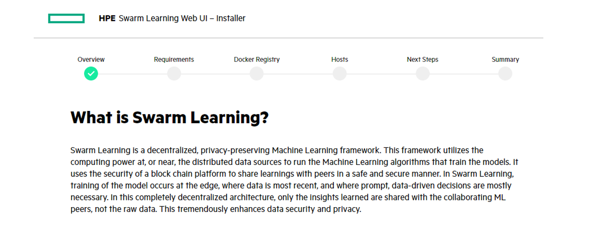

4. `Next` をクリックします。
5. 前提条件が表示されるので、確認して `Next` をクリックします。
6. Dockerレジストリへの認証情報を登録するため、HPE Passport で使用しているメールアドレスを記載し、`Next` をクリックします。

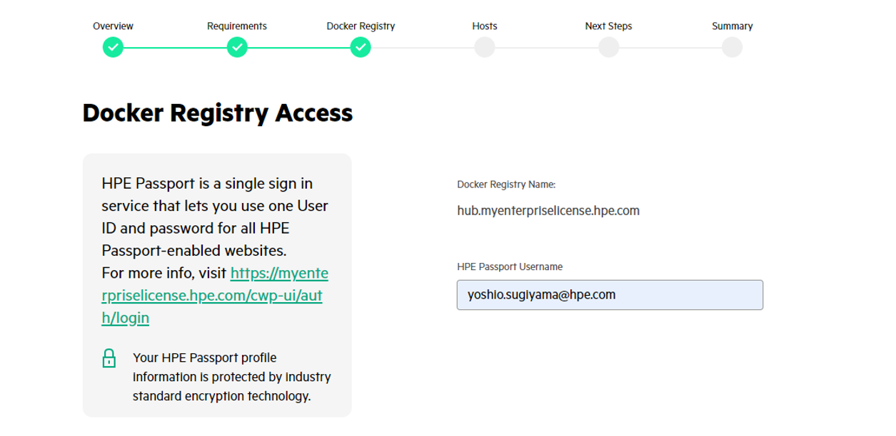

7. インストール先のホストと、インストール先ディレクトリの情報を入力します。

インストール先のディレクトリは、予め作成されている必要があることに、ご注意ください。

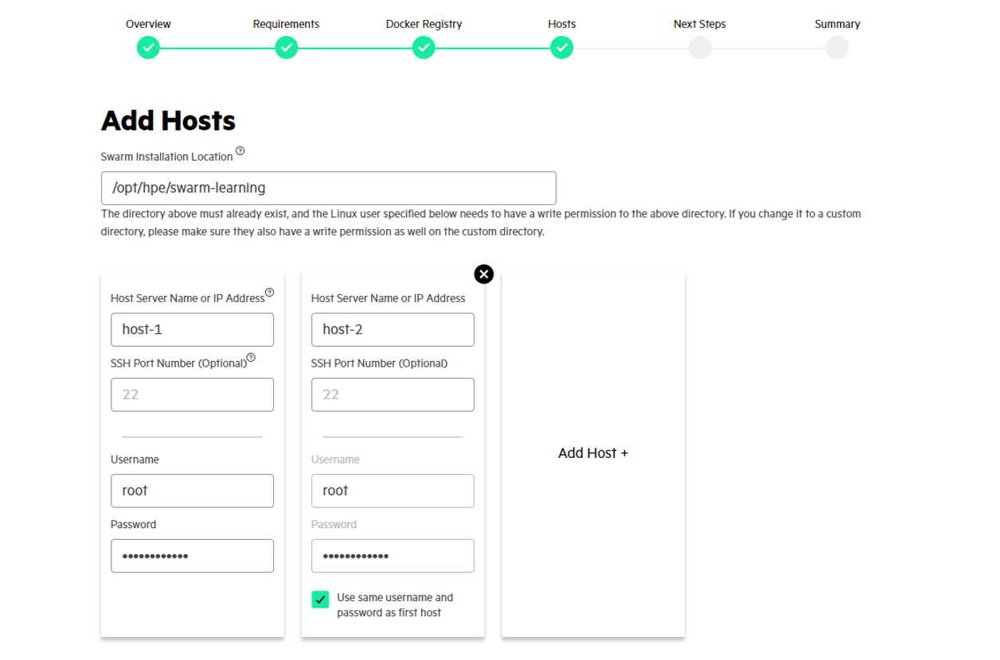

ファイルの配布と、Dockerコンテナイメージのダウンロードが開始されます。

> Swarm Learning はコンテナ (not Kubernetes) で動きます。詳細は、[次回](../hpe-swarm-learning-how-to-use/)の記事でご紹介します。

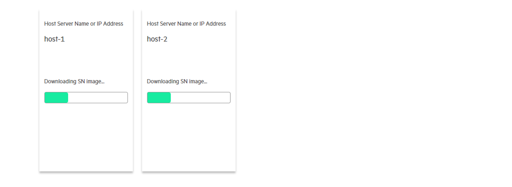

8. Installed Successfully と表示されたら、`Next` をクリックします。


9. Next Steps が表示されますが、すでにAPLSはインストール済みなので、`Next` をクリックします。
10. Summary が表示されるので、`Finish` をクリックします。

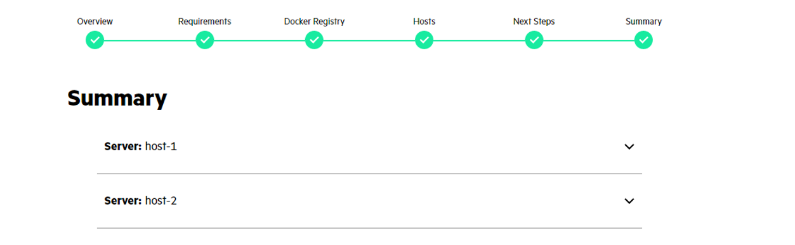

11. ブラウザを閉じます。


12. ターミナルで起動したインストーラーは `Ctrl-C` で終了します。


### Swarm Learning ライブラリダウンロード

1. Swarm Learningの各システムのOSにログインし、Swarm Learning のパッケージをダウンロードします。

```
curl -L https://github.com/HewlettPackard/swarm-learning/archive/master.zip \
-o swarm-learning-master.zip
```

2. 作業用ディレクトリを作成し、パッケージを解凍します。

```
unzip swarm-learning-master.zip
```

解凍したファイルを先程インストーラーで指定したディレクトリへ移動します。

```
mv swarm-learning-master/* /opt/hpe/swarm-learning/
```

`lib`ディレクトリ内の、Swarm Learningライブラリ wheel ファイル にシンボリックリンクを作成します。ファイル名に含まれるバージョンは適宜読み替えてください。

```
cd /opt/hpe/swarm-learning/lib
ln -fs swarmlearning-1.0.1-py3-none-manylinux_2_24_x86_64.whl \
swarmlearning-client-py3-none-manylinux_2_24_x86_64.whl
cd ..
pwd
```

以下のようなフォルダ構成となっているかと思います。

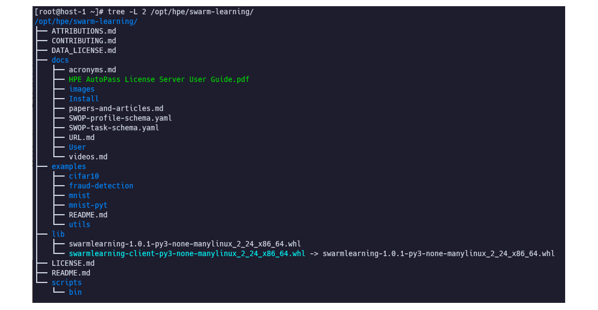

各ディレクトリに含まれているファイルは以下のとおりです。

* `lib`: Swarm Learning のライブラリです。このライブラリには、TensorflowやPyTorchのCallbackなどが入っています。
* `scripts/bin`: Swarm Learning の各コンポーネントの起動スクリプトが入っています。
* `examples`: Swarm Learning を使用した学習のチュートリアル用の設定ファイルやプログラムが入っています。
* `docs`: Swarm Learning の各種マニュアルが入っています。


以上で、Swarm Learning のセットアップが完了です。お疲れ様でした。


## 次回へ

この記事では、 Swarm Learning のインストール方法をご紹介しました。次回の記事では、Swarm Learning の使い方について
ご紹介したいと思います。

- [Swarm Learning 使い方](../hpe-swarm-learning-how-to-use/)

その他の Swarm Learning の記事はこちらです。

- [Tags - HPE Swarm Learning](/tag/HPE%20Swarm%20Learning/)

## 参照

- [GitHub - HewlettPackard/swarm-learning](https://github.com/HewlettPackard/swarm-learning)
- [MY HPE SOFTWARE CENTER](https://myenterpriselicense.hpe.com/cwp-ui/auth/login)
