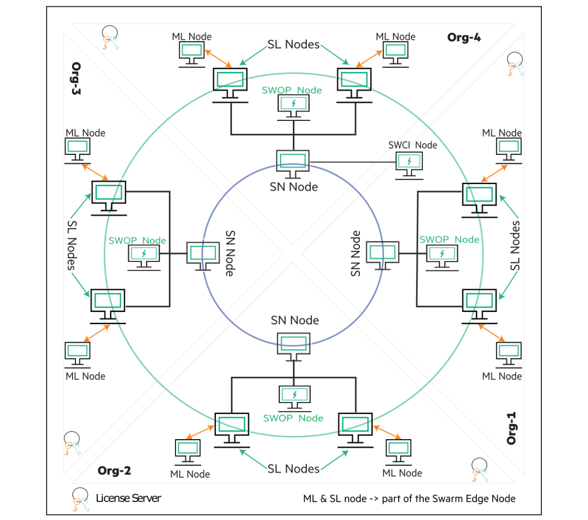
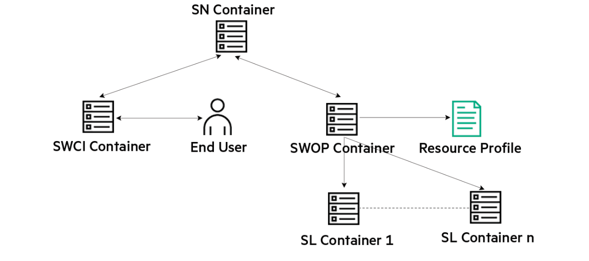
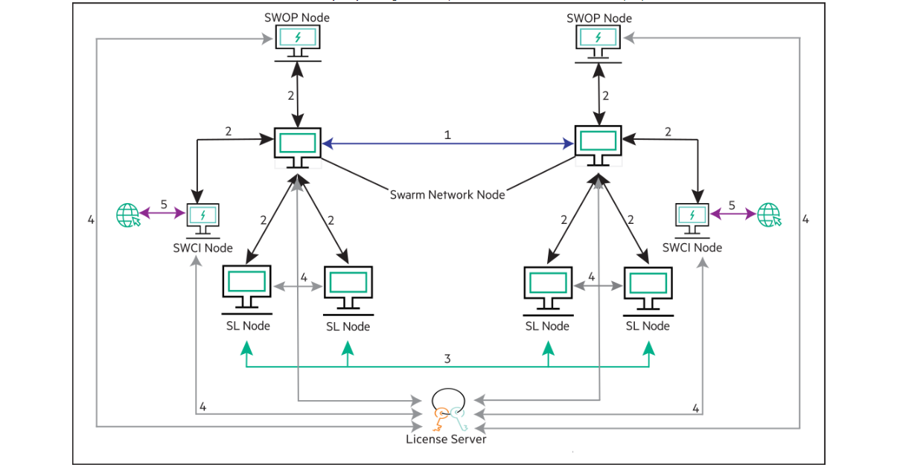

先日、日本ヒューレット・パッカード から [HPE Swarm Learning](https://www.hpe.com/jp/ja/japan/newsroom/press-release/2022/052502.html) というソフトウェアが発表されました。

この Swarm Learning は製品版とコミュニティ版があり、コミュニティ版は無料で使えるのですが、
使い方が、少々ややこしいので、私がやってみた、をご紹介したいと思います。

その前に、 Swarm Learning はどんなソフトウェアで、何が嬉しいのか、を簡単にご紹介します。

<!-- START doctoc generated TOC please keep comment here to allow auto update -->
<!-- DON'T EDIT THIS SECTION, INSTEAD RE-RUN doctoc TO UPDATE -->

- [Swarm Learning とは](#swarm-learning-%E3%81%A8%E3%81%AF)
- [Swarm Learning のアーキテクチャ](#swarm-learning-%E3%81%AE%E3%82%A2%E3%83%BC%E3%82%AD%E3%83%86%E3%82%AF%E3%83%81%E3%83%A3)
- [Swarm Learning の通信](#swarm-learning-%E3%81%AE%E9%80%9A%E4%BF%A1)
- [次回へ](#%E6%AC%A1%E5%9B%9E%E3%81%B8)
- [参照](#%E5%8F%82%E7%85%A7)

<!-- END doctoc generated TOC please keep comment here to allow auto update -->

## Swarm Learning とは

Swarm Learning は 連合学習 (Federated Learning) の一種です。

連合学習とは、地理的に離れた場所にあるデータを集めることなく、データのある各拠点で学習を行い、
その結果を、マージすることで、精度の向上を目指す学習法です。

連合学習は、プライバシーの観点からデータの移動が難しい場合や、
複数の事業者間で双方が所有するデータを合わせて学習する際に、利用することが検討されます。

一般的な連合学習では、学習を統括するリーダーが存在し、リーダーから配布されたモデルを使って、
エッジで学習を行い、学習結果をリーダーに返却します。
リーダーは返却された学習結果をマージして、モデルを更新します。
この処理を繰り返します。

モデルのサイズは、一般的にはデータのサイズより遥かに小さいため、データ転送サイズは小さく、
効率的な学習方法となります。

一方で以下のような懸念もあります。

- リーダーが学習の結果を取りまとめて、モデルを更新するため、モデルを恣意的に更新されてしまうが可能性があります。
- エッジでのデータ量が小さい場合、学習結果から、学習に使ったデータが推測されてしまう可能性があります。

このような懸念をなくし、プライバシーに配慮しつつ、分散されたデータでの学習を可能にしたのが Swarm Learning です。

Swarm Learning ではエッジ間を、ブロックチェーン を使ったP2Pで接続し、リーダーを持ちません。

学習結果のマージのたびに、一時的なリーダーが選出され、モデルのマージが行われます。
(そのため、あるエッジの学習結果が、1箇所に集まり続けることがありません。)

これにより、連合学習のメリットを享受しつつ、デメリットを排除することができました。

## Swarm Learning のアーキテクチャ

> 画像はこちらより。
> https://github.com/HewlettPackard/swarm-learning

Swarm Learning には以下のコンポーネントがあります。

- **Swarm Network node** (以下、SN): SNはブロックチェーンネットワークを形成します。各SNはブロックチェーンネットワークで互いに通信し、学習の進捗状況を維持、追跡します。この状態と進捗状況を使用して、他のSwarm Learningのコンポーネントの動作を調整します。
- **Sentinel Node**: 特別なSNです。Sentinel Node はブロックチェーンを初期化する役割を担っています。
- **Swarm Learning node** (以下、SL): SLは定期的に他のSLと学習内容を共有します。SLは、ユーザーモデルアプリケーション(後述のMLのこと)と他のSwarm Learningコンポーネントとの間のインターフェースとして機能します。SLは安全な方法でモデルの重みを分配し、結合することを担当します。
- **user Machine Learning node** (以下、ML): SLはTensorflowやKeras、Pytorchを使用して学習を行うノードです。
- **Swarm Operator node** (以下、SWOP): Swarm Learning の運用を管理します。SWOPは自分に割り当てられたタスクを実行する責任を負います。SWOPは一度に1つのタスクしか実行できません。SWOPは、タスクの実行の開始と停止、MLコンテナの構築とアップグレード、学習用モデルの共有などのタスクの実行を支援します。
- **Swarm Learning Command Interface** (以下、SWCI): Swarm Learningのコマンドラインインタフェースツールです。Swarm Learningを操作・監視するために使用されます。SWCIは任意のSNノードに接続し、Swarm Learningを管理することができます。
- **AutoPass License Server** (以下、APLS): APLSは、Swarm Learningを動作させるために必要なライセンスをインストールし、管理します。

## Swarm Learning の通信

Swarm Learning は各コンポーネント間での通信に使用するポートがあります。
Swarm Learning を起動するシステムでは、これらのポートが開いている必要があります。

1. 各SN間のP2P通信のためのポート。デフォルト設定では 30303 が使用されます。
2. SNのAPIサーバーのポート。各Swarm Learningコンポーネントとの通信で使用します。デフォルト設定では 30304 が使用されます。
3. 各SL間のP2P通信のためのポート。モデルの重みをSL間で共有する際に使用します。デフォルト設定では 30305 が使用されます。
4. APLSのAPIサーバーのポート。各Swarm Learningコンポーネントがライセンスの確認のために使用します。デフォルト設定では5814 が使用されます。
5. (オプション) SWCI がRESTベースのAPIサーバーを実行するために使用するポート。デフォルト設定では 30306 が使用されます。

## 次回へ

この記事では、 Swarm Learning の概要をご紹介しました。次回の記事では、Swarm Learning のインストール方法について
ご紹介したいと思います。

- [Swarm Learning インストール](../hpe-swarm-learning-install/)
- [Swarm Learning 使い方](../hpe-swarm-learning-how-to-use/)

その他の Swarm Learning の記事はこちらです。

- [Tags - HPE Swarm Learning](/tag/HPE%20Swarm%20Learning/)

## 参照

- [GitHub - HewlettPackard/swarm-learning](https://github.com/HewlettPackard/swarm-learning)
- [MY HPE SOFTWARE CENTER](https://myenterpriselicense.hpe.com/cwp-ui/auth/login)
