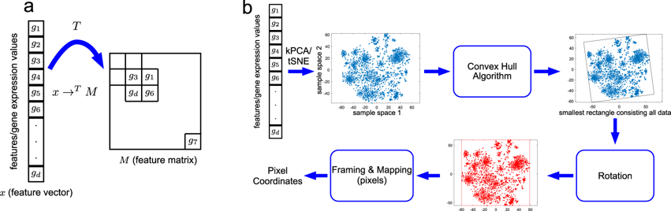
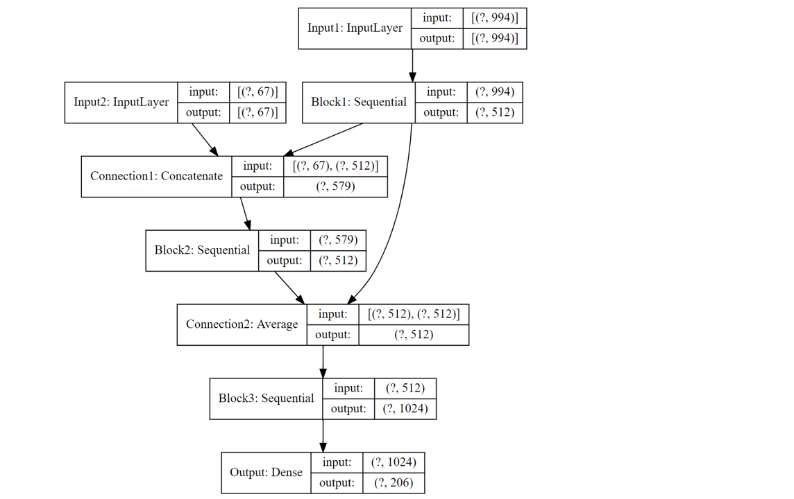
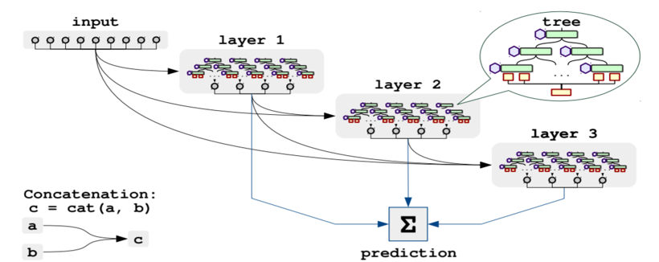
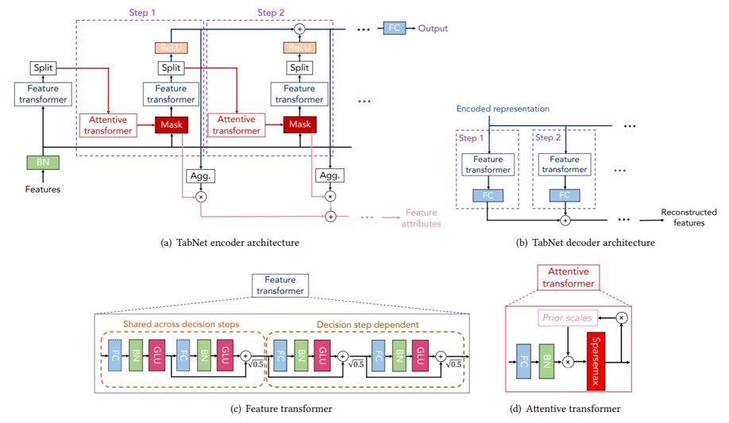
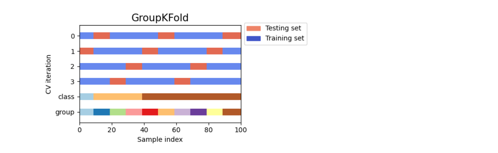
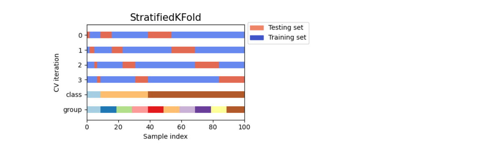
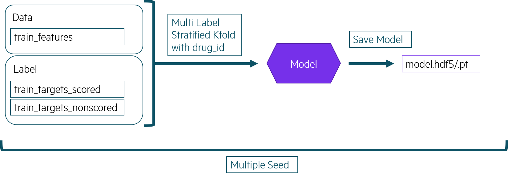
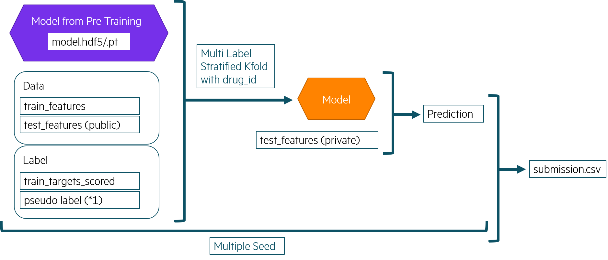

2020/9/4から2020/12/1までKaggleで Mechanisms of Action (MoA) Prediction コンペが開催されました。
参加された皆様、お疲れさまでした。

私は、日頃はインフラエンジニアでインフラの自動化やビッグデータ基盤の検討、設計、構築などを
しています。
のですが、基盤の上で動く機械学習にも興味を持ち、半年ほど基礎勉強？をして、今回、このコンペに
参加しました。

機械学習の実力的には、自分で道を切り開いていけるほどではないので、Public NotebookやDiscussionの
内容を噛み砕いて、自分のNotebookに取り込んで、改良していくスタイルで取り組みました。

コンペ序盤に、オーバーフィッティングで、金メダル圏内まで行ったのですが、
中盤で `drug_id` が明らかにされてからは、いかに汎化性能を上げられるのかを調べながら望みました。

それでは、(Public Notebookで公開されているものが中心になりますが、、)今回のコンペで
私がトライしてみたことを中心に振り返ってみます。

<!-- START doctoc generated TOC please keep comment here to allow auto update -->
<!-- DON'T EDIT THIS SECTION, INSTEAD RE-RUN doctoc TO UPDATE -->
**Table of Contents**  *generated with [DocToc](https://github.com/thlorenz/doctoc)*

- [Overview](#overview)
  - [目的](#%E7%9B%AE%E7%9A%84)
  - [データ](#%E3%83%87%E3%83%BC%E3%82%BF)
  - [評価](#%E8%A9%95%E4%BE%A1)
  - [コード要件](#%E3%82%B3%E3%83%BC%E3%83%89%E8%A6%81%E4%BB%B6)
  - [データ概観](#%E3%83%87%E3%83%BC%E3%82%BF%E6%A6%82%E8%A6%B3)
    - [データ数](#%E3%83%87%E3%83%BC%E3%82%BF%E6%95%B0)
    - [データが不均衡](#%E3%83%87%E3%83%BC%E3%82%BF%E3%81%8C%E4%B8%8D%E5%9D%87%E8%A1%A1)
- [Preprocessing](#preprocessing)
  - [Rank Gauss](#rank-gauss)
  - [PCA](#pca)
  - [Variance Threshold](#variance-threshold)
  - [Deep Insight](#deep-insight)
- [Model](#model)
  - [Multi Input ResNet](#multi-input-resnet)
  - [NODE (Neural Oblivious Decision Ensembles)](#node-neural-oblivious-decision-ensembles)
  - [TabNet](#tabnet)
- [Training](#training)
  - [Group Multi Label Stratified KFold](#group-multi-label-stratified-kfold)
  - [Pre Training](#pre-training)
  - [Training](#training-1)
- [その他](#%E3%81%9D%E3%81%AE%E4%BB%96)
  - [Some tips to avoid overfitting](#some-tips-to-avoid-overfitting)
  - [Kaggle on Google Colab](#kaggle-on-google-colab)
- [結果と感想](#%E7%B5%90%E6%9E%9C%E3%81%A8%E6%84%9F%E6%83%B3)

<!-- END doctoc generated TOC please keep comment here to allow auto update -->

## Overview

### 目的

Mechanisms of Action (MoA) 作用機序(薬の働き)の予測します。
MoA予測アルゴリズムの改善を通じて医薬品開発を前進させることを目標としています。

### データ

遺伝子発現データや細胞生存率データなどの様々なインプットを与えられた異なるサンプル（`sig_id`）の
作用機序（MoA）応答の複数のターゲットを予測します。

### 評価

各 `sig_id` について、サンプルが各MoAターゲットに対して正の応答を持っている確率を予測します。
N個の `sig_id` 行とM個のMoAターゲットについて、N×Mの予測を行います。提出物は対数損失で採点されます。

### コード要件

提出は、Jupyter Notebook形式で、実行時間が GPUなら2時間、CPUなら9時間 以内に実行できる必要があります。

### データ概観

#### データ数

- 学習データ: 23814個のサンプル x 875個の特徴量
- 学習ラベル: 206ラベル
- Public テストデータ: 3982個のサンプル x 875個の特徴量

> Public テストデータの 206 ラベルを予測するnotebook を提出します。
> 提出すると、Public テストデータが、Private テストデータに置き換えられた状態でnotebook が実行され、
> Privateテストデータの予測結果が評価されます。Privateテストデータは Publicテストデータの3倍程度あります。

- 非学習ラベル: 402ラベル

> 学習データに対応する 402 のラベルが与えられており、自由に学習に使用できます。

- ドラッグID: 学習データのサンプルと薬剤IDの紐付け

#### データが不均衡

- 少なくとも50以上のラベルで、陽性サンプル数が 0.1% 以下 (20サンプル以下) ですが、
  あるラベルでは、陽性数が、全サンプルの 3.5% (約830) あります。
- 学習サンプルの 40% がすべてのラベルで 陰性 (MoAを持たない)であり、 50% 以上が陽性ラベルを1つだけ持ちます。
  一方で、陽性ラベルを7つ持つサンプルもあります。

## Preprocessing

### Rank Gauss

RankGaussは数値変数を正規分布に変換する方法です。

- モデルにニューラルネットワークを使用する際の特徴量変換の手法として、
  Min-Max Normalizationや標準化よりも優れた性能を発揮すると言われています。
- 数値の大きさ、間隔に重大な意味がなく、その大小関係のみ重要な場合に使用することができます。
- 外れ値の影響を軽減することができます。

変換方法

- 対象となる変数の値を順位付けし、その順位を -1 ~ 1 の範囲にスケーリングします。 （一様分布にします）
- その結果を分位関数(累積分布関数CDFの逆関数)に適用し、正規分布を得ます。

### PCA

- 今回のコンペでは、PCAの結果を既存の特徴量に「追加」することで
  [CV, LBが良くなる事象](https://www.kaggle.com/c/lish-moa/discussion/183166)が観測されています。
- しかし、一般的に、PCAの結果を既存の特徴量に追加することは[望ましくないと考えられており](https://www.quora.com/Is-there-any-benefit-from-adding-the-original-features-along-with-the-reduced-ones-by-PCA)、この考えを覆す結果となっています。

### Variance Threshold

- データの分散がしきい値以下のものを特徴量から除外します。
- ただし、事前にRank Gauss が行われている場合、特徴量の多くは 1 に近くなるため、
  分散のしきい値を下回る特徴量は[多く現れないことが指摘](https://www.kaggle.com/c/lish-moa/discussion/194973#1067941)されています。

### Deep Insight

[DeepInsight: A methodology to transform a non-image data to an image for convolution neural network architecture](https://www.nature.com/articles/s41598-019-47765-6)

非画像データにCNNを適用するためのテクニックです。

- まず第一に、t-SNEやカーネルPCAのような非線形次元削減技術を適用して、生の特徴を2D埋め込み特徴空間に変換します。
- 次に、すべての特徴を含む最小の矩形を見つけるために凸殻アルゴリズムが使用され、
  特徴マップのフレームを水平または垂直に整列させるために回転が実行されます。
- 最後に、生の特徴値を特徴マップ画像のピクセル座標位置にマッピングします。

特徴マップ画像の解像度は、特徴の重複の割合（同じ位置にマッピングされた特徴が平均化される）に影響を与えます。

## Model

### Multi Input ResNet

今回のコンペではNeural Networkの有効性が指摘されていました。
下記のような入力が2つあるResNetも、Publicノートブックで多く使用されていました。

### NODE (Neural Oblivious Decision Ensembles)

[Neural Oblivious Decision Ensembles for Deep Learning on Tabular Data](https://arxiv.org/abs/1909.06312)

- 表形式データにおいて、勾配ブースト決定木(BGDT) を凌駕する性能が期待されている手法です。
- 誤差逆伝播法によりエンドツーエンドで学習される微分可能な忘却決定木 (Oblivious Decision Tree: ODT) で構成されています。

### TabNet

[TabNet : Attentive Interpretable Tabular Learning](https://github.com/dreamquark-ai/tabnet)

- 各決定ステップでどの特徴から推論すべきかを選択するためにSequential Attentionを使用し、
  解釈可能性とより効率的な学習を可能にします。
- 表形式データに対する自己教師あり学習も可能です。

## Training

### Group Multi Label Stratified KFold

Group KFold

- 今回のコンペは学習データに同一薬剤が複数サンプル存在し、かつ、どのサンプルが同一の薬剤か、の情報が当初、ありませんでした。
  そのため、交差検証を行う際、学習データと検証データに同一の薬剤が含まれてしまう可能性がありました(データのリーク)。
  結果として、ある薬剤への過学習となり、未知の薬剤に対する学習能力の向上が難しい状況でした。
- コンペ中盤に、薬剤とサンプルの紐付けのデータが公開され、ある薬剤を同一の交差検証の分割に入れることが可能になりました。

Stratified KFold

- ラベルが不均衡であったため、交差検証の分割を行った際に、1つの分割に含まれるラベルの分布が、
  分割前と同等となるように分割する Stratified KFold が利用されました。

> [Cross-validation: evaluating estimator performance](https://scikit-learn.org/stable/modules/cross_validation.html)

### Pre Training

私が行った学習法です。

- 事前学習の目的は、メインの学習の良い初期値を得ることです。
- メインの学習は、実行時間の制限もあるため、予め事前学習したモデルをデータセットとして取り込むことで、時間の節約も目的です。

### Training

- メインの学習はデータ量を増やすため、Publicテストデータも使用しました。
  Publicテストデータのラベルは過去のSubmissionの一番良いLBのときのを使いました。

## その他

### Some tips to avoid overfitting

[Discussion: Some tips to avoid overfitting](https://www.kaggle.com/c/lish-moa/discussion/196913)

過学習を避けるためのTipsを紹介いただいたディスカッションです。

- 同じ検証データを頻繁に使用しないこと
- ブレンドの重みを過度にPublic LBを基に決めないこと
- モデルの更新は、CVが十分に改善されている場合にのみ行うこと

などが提案されています。

### Kaggle on Google Colab

私は今回のコンペにGoogle Colabも使用しました。Google Colabでコンペをやりやすくするために以下を行いました。

- Kaggle上のKernelをGoogle Driveに Download/Upload する[notebook](https://github.com/IMOKURI/kaggle_on_google_colab/blob/master/kaggle_connect.ipynb)を作りました。
  kaggle apiのtokenをGoogle Driveに追いて、このnotebookをgoogle colab上で実行して使います。
- Kaggle上のnotebookに 「Google Colabで実行中か」 を判定する仕組みを入れました。
  もし、Google Colab上であれば、コンペのデータセットをダウンロードする、などの処理が入っています。
  [こちらがその雛形](https://github.com/IMOKURI/kaggle_on_google_colab/blob/master/kaggle_basic.ipynb)です。

Google Colab Pro 早く日本にも来てほしいですね。

### Notebook の構成

- 私は学習用とハイパーパラメータチューニング用を共通化しました。
  学習用に変更があったとき、ハイパーパラメータチューニング用のに漏れなく反映させるのが辛かったからです。
  ただ、共通化したのも、それはそれで辛かったので、どうしたものでしょうか。
  (スクリプトならモジュールにするとか方法はありそうなのですが、Notebookだとどうするのが良かったか)
- モデルごとの学習も、基本1つのNotebook内で、行いました。
  後に、[学習用と、推論用を分ける手法](https://www.kaggle.com/underwearfitting/make-final-submission-the-efficient-way)を知りました。

## 結果と感想

結果は、539th でした。コンペの楽しさを感じるとともに、データ分析の難しさも感じました。
また、トライして、Kaggle Expert を目指していきたいと思います。

- データの分割(train, test)などについて、もっと主催者の思いを汲めたら良かったなと思います。特に今回はKFoldの作り方を
  もう少し工夫すべきだったかと感じています。
- 最終Sub選択の難しさを感じました。今回 Trust your CV で行ったのですが、もう少し Public LB を信用しても良かったかなと思いました。。

今回はソロでチャレンジしたのですが、今後、チームでもやってみたいと思います。ありがとうございました。
