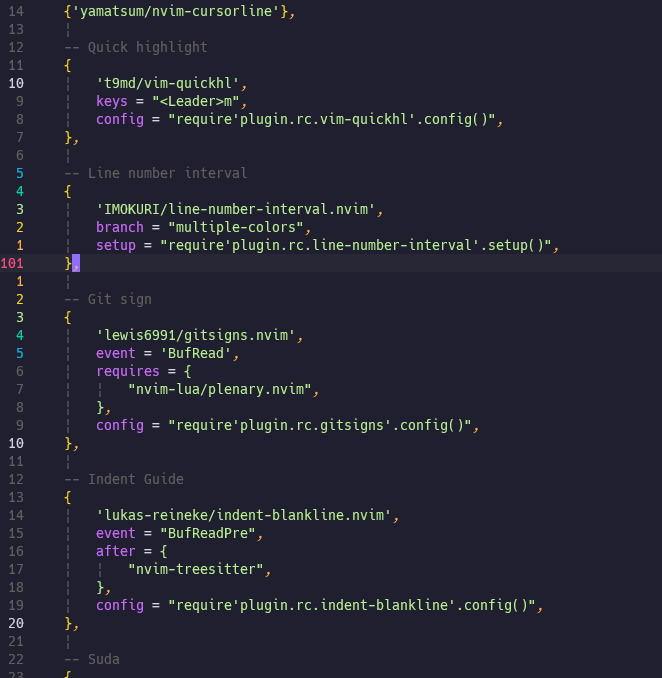

以前、作成した neovim のプラグインに feature idea を頂いたので、実装しました。

プラグインは、[こちら](https://github.com/IMOKURI/line-number-interval.nvim)です。

行番号を xx 行おきにハイライトするものです。

その xx 行おき、の xx の部分はカスタマイズできるようになっていたのですが、
今回、この色もカスタマイズできないか、という[アイデア](https://github.com/IMOKURI/line-number-interval.nvim/issues/5)をいただきました。

色が段階的に変えられると、確かに、見やすく？なっていい感じかもしれないと思い、実装してみました。

↑ の画像では、以下のような配色にしています。

- `CursorLine` を赤に
- `HighlightedLineNr1` ~ `HighlightedLineNr5` を虹色に
- `HighlightedLineNr` を白に
- `DimLineNr` を暗い色に

こういうアイデアを思いつけるようになりたいですなー。
