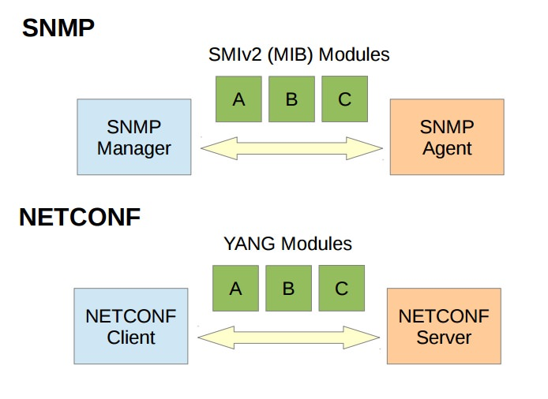
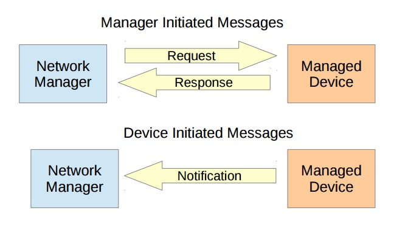
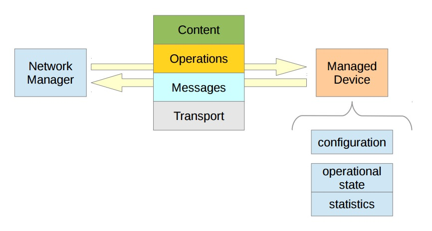
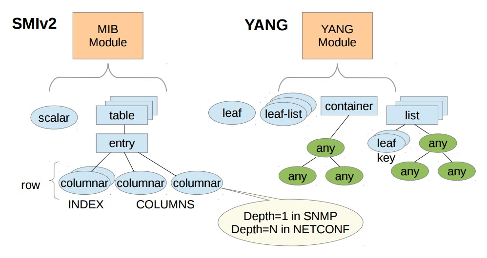

[NETCONF](https://tools.ietf.org/html/rfc6241)は、IETFによって策定が進められているNetwork管理用のプロトコルです。  
[YANG](https://tools.ietf.org/html/rfc6020)は、NETCONFのデータを表現するための言語です。

これらは、[IESG](http://www.ietf.org/iesg/)（IETFの活動と標準化プロセスの、技術的な側面についての責任を担っているグループ）によって使用が推奨され始めています。[こちら](http://www.ietf.org/iesg/statement/writable-mib-module.html)  

今後、SNMP/SMI2に取って代わるであろうYANG/NETCONFについて、まとめていきます。

<!--more-->

### 概要

SNMPとNETCONFの仕組みはかなり似ています。

SNMPが、SNMP ManagerとSNMP Agentの間を、さまざまなMIB(SMIv2)モジュールの定義に沿って、SNMPのプロトコルでやり取りをするように、  
NETCONFは、NETCONF clientとNETCONF Serverの間を、さまざまなYANGモジュールの定義に沿って、NETCONFのプロトコルでやりとりします。  

\

SNMPとNETCONFは、メッセージのやりとりの仕組みもかなり似ています。

どちらも、「Managerからリクエストし、Deviceが応答する仕組み」と「Deviceが能動的に、Managerに通知する仕組み」があります。  

\

---

**では、なぜ、NETCONFを使う必要があるのでしょうか。**

それには、大きく2つの理由があります。

1. 強固なトランザクションのモデルをもっていること
    * SNMPは、トランザクションの仕組みを持っておらず、機器の設定管理には不向きでした。
    * NETCONFは、トランザクションの仕組みを持っており、妥当性の確認や、ロールバックが使用可能です。また、ネットワークにまたがって（複数の機器にまたがって）トランザクションを発行、コミットを行うことが可能です。
1. SNMPにはない特徴をもっていること
    * YANGによる応用力のある定義が可能であること
    * YANGによって、独自のプロトコル操作が定義できること
    * データに応じたツールをサポートするための言語表現が可能なこと
    * XMLサブツリーとXPathを使って、受信したデータに対して、さまざまなフィルタができること

---

**NETCONFのプロトコルのレイヤーについて**

NETCONFのプロトコルには、4つのレイヤーがあります。それぞれのレイヤーでSNMPの場合の何に対応するのかをまとめます。

1. コンテンツレイヤー
    * SNMPでいうところのbind変数のリストの情報が含まれます。NETCONFの場合は、XMLのサブツリーで表現します。
1. オペレーションレイヤー
    * SNMPの場合はRFCで定義されている情報が含まれます。NETCONFの場合は、YANGでの定義の内容になります。
1. メッセージレイヤー
    * SNMPの場合は、SNMPのPDUに該当します。NETCONFでは、リモートプロシージャーコール(RPC)となります。
1. トランスポートレイヤー
    * SNMPでは、メッセージベースでのデータ転送となりますが、NETCONFの場合はセッションベースでのやりとりになります。
    * SNMPでは、UDPを使用します。NETCONFでは、SSHもしくは、TLS over TCPを使用します。

\

具体的な、要素の比較は以下になります。  

| Layer                        | SNMP/SMIv2                       | NETCONF/YANG                        |
|------------------------------|----------------------------------|-------------------------------------|
| Content (Device Data)        | OBJECT-TYPE                      | data-def-stmt                       |
| Content (Notification Data)  | NOTIFICATION-TYPE                | notification-stmt                   |
| Operations                   | Set, Get, GetNext, GetBulk       | rpc-stmt (edit-config, copy-config) |
| Messages (Device Data)       | Set, Get, GetNext, GetBulk PDUs  | \<rpc>, \<rpc-reply>                |
| Messages (Notification Data) | Trap PDU, Inform PDU, Report PDU | \<notification>, N/A, N/A           |
| Transport                    | Message-based: UDP               | Session-based: SSH/TCP              |

---

**NETCONFの設定、データについて**

NETCONFの設定はデータストアに格納されます。データストアとはその名の通り設定などが格納される場所のことで、ファイルだったり、データベースだったりします。  
設定データストアにはデバイスの設定など書き込み可能なデータが含まれます。  
一方、状態データには、設定ではない、機器の状態や統計情報などの読み取り専用の情報が含まれます。  

YANGのXPathでは、この設定データと非設定データ（状態データ）を明確に分けています。  
それは、設定のダンプやリストアの際にわかりやすいようにするため、などの理由によります。詳細は[こちら](https://tools.ietf.org/html/rfc3535#section-3)  

---

**YANGとSMIv2の基本的なデータ構成の違い**

* YANGは、以下の要素を持ちます。
    + リーフノード
        - リーフノードは、整数や文字列などのシンプルなデータを持ちます。
        - 特定のタイプのデータを一つだけ持つことができ、子ノードは持ちません。
    + リーフリストノード
        - リーフリストは、リーフノードのリストです。
        - リーフノードは全て同じタイプのデータを持っている必要があります。
    + コンテナーノード
        - コンテナーノードは、サブツリー内の関連のあるノードをグルーピングするのに使われます。
        - コンテナーノードは、直接値をもたず、子ノードだけを持つことができます。
        - 子ノードは複数のタイプのノードを混在させることができます。
    + リストノード
        - リストノードは、リストエントリーのリストです。
        - それぞれのリストエントリーは、そのキーリーフ(key leaf)とその値で一意に特定されます。
        - リストは、複数のキーリーフと、さまざまなタイプの子ノードを持つことができます。

* MIBモジュールは、データの定義は1階層ですが、YANGモジュールは、データは複数階層で定義できます。

\

* さらに、YANGには、チョイス／ケースノードという要素もあります。
    + チョイスノードの中に、複数のケースノードが定義できます。
    + 実際にやりとりされるデータはそのうちの1つのケースノードのデータのみになります。

ノードの説明については、RFCの[こちら](https://tools.ietf.org/html/rfc6020#section-4.2.2)の説明がわかりやすいです。  

---

長くなってきましたので、つづきは、また今度。

---

参考：  
[A Guide to NETCONF for SNMP Developers](http://www.ieee802.org/802_tutorials/2014-07/Tutorial_Berman_1407.pdf)

---

